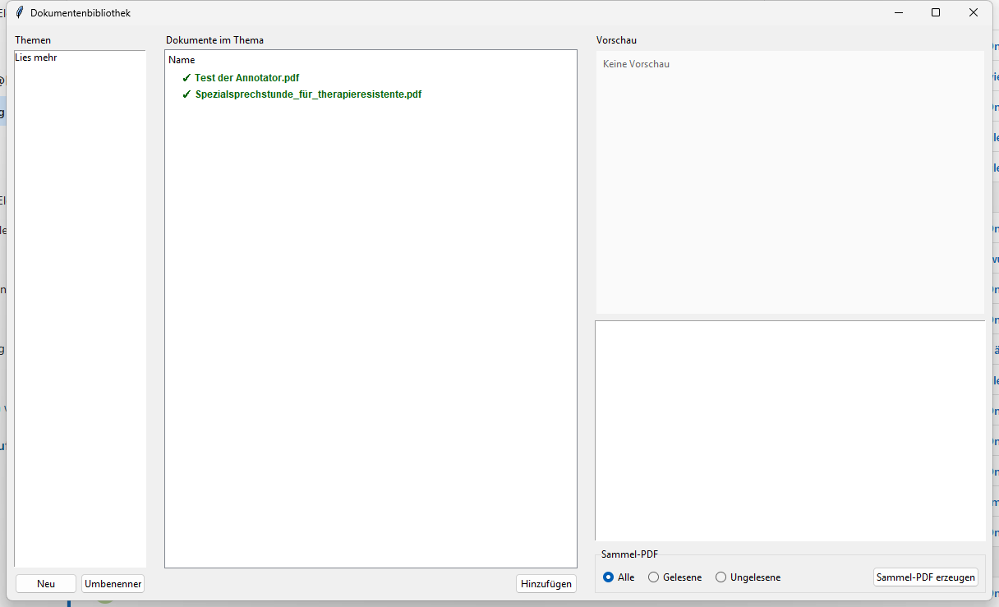

# DokuReader - Document Library

A simple desktop application for managing and organizing documents by topic with preview functionality and PDF export.

## Features

- **Topic Organization**: Create, rename, and delete topics for your documents
- **Read/Unread**: Mark documents as read (green with ✓)
- **Preview**:
  - Images (JPG, PNG, GIF)
  - PDF documents (first page)
  - Text files (TXT)
  - Office documents (DOCX, ODT)
- **Drag & Drop**: Easily add files via drag and drop (optional)
- **Double-Click Open**: Open documents in the default application
- **Batch PDF Export**: Export all, read, or unread documents as a single PDF
  - Supports: PDF, TXT, images, DOC, DOCX, ODT, RTF
  - Automatic conversion to PDF (LibreOffice or MS Word)
- **Cross-Platform**: Windows, macOS, Linux

## Technical Details

- Python 3.10+ with Tkinter
- Single-file application (756 lines)
- JSON-based persistence in the home directory
- Reference-only: Original files remain untouched

## Screenshots



## Installation

### Required Dependencies

```bash
pip install -r requirements.txt
```

### Optional Dependencies

For full functionality:
- `pdf2image` or `PyMuPDF` - PDF preview
- `tkinterdnd2` - Drag & Drop
- `python-docx` - DOCX preview
- `odfpy` - ODT preview
- `reportlab` - TXT/image to PDF conversion
- `pypdf` or `PyPDF2` - PDF merge
- `pywin32` (Windows) - Word COM for Office conversion

### LibreOffice (for Office → PDF conversion)

For best support of DOC/DOCX/ODT/RTF → PDF:
- **Linux**: `sudo apt-get install libreoffice`
- **macOS**: `brew install --cask libreoffice`
- **Windows**: Download from https://www.libreoffice.org/

## Usage

```bash
python DokuReader.py
```

Or via START.bat (Windows):
```bash
START.bat
```

## Data Storage

State is saved in: `~/.dokubibliothek_state.json`

## Supported File Formats

- Documents: `.txt`, `.doc`, `.docx`, `.pdf`, `.odt`, `.rtf`
- Images: `.jpg`, `.jpeg`, `.gif`, `.png`

## License

GPL v3 - See [LICENSE](LICENSE)

---

Deutsche Version: [README.de.md](README.de.md)
