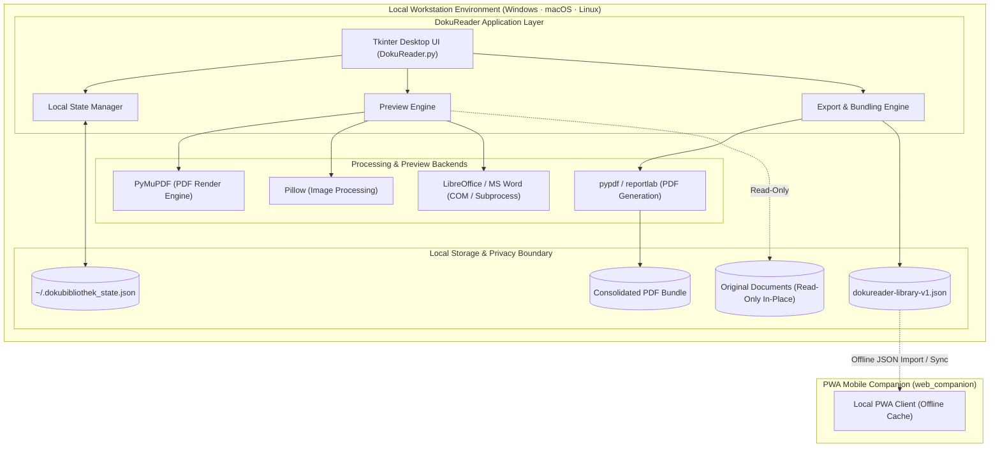
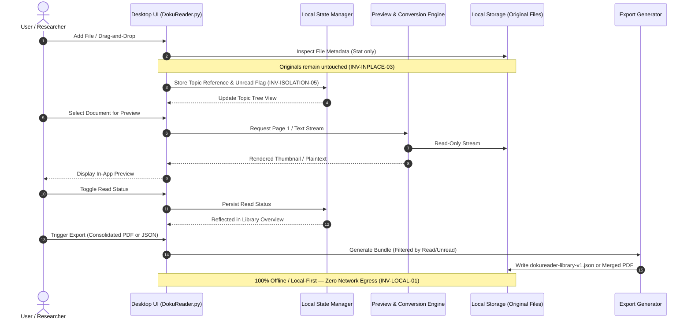

# DokuReader — Local Document Library & PDF Organizer

<p align="center"><strong>🇬🇧 English</strong> · <a href="README_de.md">🇩🇪 Deutsch</a></p>

> Organize, preview, and bundle local documents by topic — references and read status only, originals stay put.

[](LICENSE)
[](CHANGELOG.md#unreleased)
[](pyproject.toml)
[](DokuReader.py)
[](#getting-started--installation)
[](pyproject.toml)
[](web_companion)
[](PRIVACY_POLICY.md)
[](SECURITY.md)
[](SECURITY.md)
[](SECURITY.md)
[](THIRD_PARTY_LICENSES.md)
[](MARKETING-LOG.txt)
[](llms.txt)
[](https://github.com/doc-bricks)
[](https://github.com/open-bricks)
[](#quality-gates--automated-test-suites)
[](NOTICE)

> [!NOTE]
> DokuReader is part of the **doc-bricks** local document management suite. It works seamlessly alongside [LitZentrum](https://github.com/doc-bricks/LitZentrum) (citation & literature management), [CleanMarkdown](https://github.com/doc-bricks/CleanMarkdown) (Markdown reading & editing), and [UniversalDocsGrabber](https://github.com/doc-bricks/UniversalDocsGrabber) (mail attachment intake). DokuReader is fully indexed for AI/LLM coding assistants via [`llms.txt`](llms.txt).

---

### Quick Navigation
1. [Overview & Core Value](#overview--core-value)
2. [Key Capabilities & Feature Matrix](#key-capabilities--feature-matrix)
3. [Interactive Architecture Flowchart](#interactive-architecture-flowchart)
4. [Document Lifecycle & Privacy Sequence](#document-lifecycle--privacy-sequence)
5. [Getting Started & Installation](#getting-started--installation)
6. [Supported Formats & System Dependencies](#supported-formats--system-dependencies)
7. [Windows Store & Standalone Build](#windows-store--standalone-build)
8. [Mobile & PWA Companion](#mobile--pwa-companion)
9. [Governance & Runtime Invariants](#governance--runtime-invariants)
10. [Sibling Tools & Ecosystem Matrix](#sibling-tools--ecosystem-matrix)
11. [Privacy & Security Posture](#privacy--security-posture)
12. [Quality Gates & Automated Test Suites](#quality-gates--automated-test-suites)
13. [Machine-Readable Context (`llms.txt`)](#machine-readable-context-llmstxt)
14. [Third-Party Licenses & Transparency](#third-party-licenses--transparency)
15. [Marketing & Target Personas](#marketing--target-personas)

---

## Overview & Core Value

DokuReader is an unprivileged desktop application for organizing, previewing, and bundling documents by topic. Original files stay exactly where they are; the application indexes only file path references and read status in a local JSON state file (`~/.dokubibliothek_state.json`).

It is engineered specifically for private document libraries, academic research collections, confidential legal discovery sets, and topic-based reading queues that must remain 100% offline, inspectable, and secure.

| Goal | Entry Point |
|---|---|
| Run the desktop application | `python DokuReader.py` or `START.bat` |
| Understand the export specification | [EXPORTFORMAT.md](EXPORTFORMAT.md) |
| Test the desktop source build | `python tests/source_platform_smoke.py` |
| Check the mobile/PWA companion smoke | [web_companion/README.md](web_companion/README.md) |
| Check Windows Store readiness | `python _WARTUNG/check_store_readiness.py --allow-blockers` |
| Prepare or parse WACK reports | `python _WARTUNG/run_windows_wack.py --dry-run` |
| Prepare Windows Store listings | [STORE_LISTING.md](STORE_LISTING.md), [PRIVACY_POLICY.md](PRIVACY_POLICY.md), [SUPPORT.md](SUPPORT.md) |
| Provide LLM tools project context | [`llms.txt`](llms.txt) |

### Version and Release Status

The version roles are intentionally separate and read back from the current source tree:
- **Development Runtime:** `1.0.1-dev` (`DokuReader.py` and `pyproject.toml` `1.0.1.dev0`)
- **Windows Store Package Metadata:** `1.0.1.0` (`store_package.json`)
- **Release Verification:** There is no verified public release artifact in this repository. Signing, MSIX generation, WACK validation, and Store submission remain external gates. The `1.0.1-dev` badge indicates development status, not a public store release claim. See [RELEASE_STATUS.md](RELEASE_STATUS.md) and [PORTIERUNGSPLAN.md](PORTIERUNGSPLAN.md).

---

## Key Capabilities & Feature Matrix

- **In-Place File Protection (INV-INPLACE-03):** Original documents are never copied, moved, modified, or overwritten.
- **Dynamic Topic Organization:** Create, rename, sort, and delete document topics on the fly.
- **Read / Unread Queue Management:** Toggle read status with one click; filter exports by read, unread, or all.
- **Multi-Format Instant Preview:** In-app visual preview for PDFs, text files, images (JPG, PNG, GIF), and Office documents (DOCX, ODT).
- **Text Preview & Latin-1 Fallback:** Robust text rendering with UTF-8 primary and Latin-1 secondary decoding.
- **Desktop Drag-and-Drop:** Intuitive document intake when `tkinterdnd2` is installed.
- **External App Dispatch:** Double-click opens any document in the system default application.
- **Consolidated PDF Bundling:** Merge selected read, unread, or all documents into a single consolidated PDF bundle.
- **Clean JSON Metadata Export:** Export the entire library outline as schema-compliant `dokureader-library-v1.json` without copying or embedding binary document content.
- **Office Conversion Pipeline:** Seamless conversion of Office formats via headless LibreOffice or Windows Word COM.
- **Offline PWA Companion:** Zero-egress mobile web application for reviewing libraries and toggling read status on smartphones and tablets.

---

## Interactive Architecture Flowchart


```mermaid
flowchart TD
    subgraph Host ["Local Workstation Environment (Windows · macOS · Linux)"]
        subgraph App ["DokuReader Application Layer"]
            UI["Tkinter Desktop UI (DokuReader.py)"]
            StateManager["Local State Manager"]
            PreviewEngine["Preview Engine"]
            ExportEngine["Export & Bundling Engine"]
        end

        subgraph Backends ["Processing & Preview Backends"]
            MuPDF["PyMuPDF (PDF Render Engine)"]
            PIL["Pillow (Image Processing)"]
            OfficeConv["LibreOffice / MS Word (COM / Subprocess)"]
            PDFMerger["pypdf / reportlab (PDF Generation)"]
        end

        subgraph Storage ["Local Storage & Privacy Boundary"]
            Originals[("Original Documents (Read-Only In-Place)")]
            StateFile[("~/.dokubibliothek_state.json")]
            ExportFile[("dokureader-library-v1.json")]
            PDFOutput[("Consolidated PDF Bundle")]
        end
    end

    subgraph Companion ["PWA Mobile Companion (web_companion)"]
        PWA["Local PWA Client (Offline Cache)"]
    end

    UI --> StateManager
    UI --> PreviewEngine
    UI --> ExportEngine

    StateManager <--> StateFile
    PreviewEngine --> MuPDF
    PreviewEngine --> PIL
    PreviewEngine --> OfficeConv
    PreviewEngine -. Read-Only .-> Originals

    ExportEngine --> PDFMerger
    ExportEngine --> ExportFile
    PDFMerger --> PDFOutput

    ExportFile -. Offline JSON Import / Sync .-> PWA
```

---

## Document Lifecycle & Privacy Sequence


```mermaid
sequenceDiagram
    autonumber
    actor User as User / Researcher
    participant UI as Desktop UI (DokuReader.py)
    participant State as Local State Manager
    participant Engine as Preview & Conversion Engine
    participant Disk as Local Storage (Original Files)
    participant Output as Export Generator

    User->>UI: Add File / Drag-and-Drop
    UI->>Disk: Inspect File Metadata (Stat only)
    Note over UI,Disk: Originals remain untouched (INV-INPLACE-03)
    UI->>State: Store Topic Reference & Unread Flag (INV-ISOLATION-05)
    State-->>UI: Update Topic Tree View

    User->>UI: Select Document for Preview
    UI->>Engine: Request Page 1 / Text Stream
    Engine->>Disk: Read-Only Stream
    Engine-->>UI: Rendered Thumbnail / Plaintext
    UI-->>User: Display In-App Preview

    User->>UI: Toggle Read Status
    UI->>State: Persist Read Status
    State-->>UI: Reflected in Library Overview

    User->>UI: Trigger Export (Consolidated PDF or JSON)
    UI->>Output: Generate Bundle (Filtered by Read/Unread)
    Output->>Disk: Write dokureader-library-v1.json or Merged PDF
    Note over UI,Disk: 100% Offline / Local-First — Zero Network Egress (INV-LOCAL-01)
```

---

## Getting Started & Installation

### Requirements

- Python 3.10+
- Tkinter (included with standard Python installations)

### Installation

```bash
git clone https://github.com/doc-bricks/DokuReader.git
cd DokuReader
pip install -r requirements.txt
```

### Quick Start

```bash
python DokuReader.py
```

On Windows, launch directly via:

```bat
START.bat
```

---

## Supported Formats & System Dependencies

### Supported Document Formats

- **Documents:** `.txt`, `.doc`, `.docx`, `.pdf`, `.odt`, `.rtf`
- **Images:** `.jpg`, `.jpeg`, `.gif`, `.png`

### Optional System Dependencies

For full preview rendering and external document conversion:
- **LibreOffice:** Required for headless DOC/DOCX/ODT/RTF to PDF conversion.
- **Poppler:** Required if using the optional `pdf2image` preview backend.
- **Microsoft Word:** Supported on Windows for direct COM-based document conversion.

---

## Windows Store & Standalone Build

### Local Executable Build

```bat
build_exe.bat
```

Build output under `build/`, `dist/`, and `releases/` stays strictly local and is excluded from Git tracking via `.gitignore`. Set `DOKUREADER_BUILD_ROOT` to customize the local build scratch directory.

### Windows Store Readiness Gate

```bash
python _WARTUNG/check_store_readiness.py --allow-blockers
```

Validates Store metadata, privacy policy URLs, required support links, visual assets, screenshots, and MSIX packaging requirements.

### WACK Runner & Parser

```bash
python _WARTUNG/run_windows_wack.py --dry-run
```

Generates the exact certification command for elevated execution and parses resulting XML validation reports into structured JSON.

---

## Mobile & PWA Companion

The companion web application under `web_companion/` provides an offline-first, mobile-optimized reading view:
- **Installable PWA:** Full Web App Manifest with iOS Safe-Area support (`viewport-fit=cover`).
- **Offline Shell:** Scoped Service Worker caching preserving external application caches.
- **Round-Trip Synchronization:** Imports `dokureader-library-v1.json` exported from the desktop app, allows toggling read states on mobile, and exports an updated JSON back to the desktop.
- **Zero Third-Party Dependencies:** Runs on pure vanilla JavaScript and Node.js built-in test runner (`35 passed, 0 failed`).

```bash
cd web_companion
node --test
```

---

## Governance & Runtime Invariants

The following 10 invariants govern DokuReader's runtime architecture, privacy boundary, and security guarantees:

| Invariant | Principle | Guarantee & Verification Mechanism |
|:---|:---|:---|
| **INV-LOCAL-01** | 100% Local-First & Zero-Egress | Zero outbound HTTP/S, WebSocket, or telemetry traffic. All parsing and previews operate strictly offline. |
| **INV-RUNAS-02** | Unprivileged RunAsInvoker Execution | The application runs exclusively in standard user mode without administrative elevation requirements. |
| **INV-INPLACE-03** | In-Place Original File Safety | Original documents are strictly read-only. DokuReader never moves, modifies, or deletes imported files. |
| **INV-SCHEMA-04** | Deterministic Export Schema | Library metadata exports adhere strictly to the versioned `dokureader-library-v1` JSON specification. |
| **INV-ISOLATION-05** | Local State & Cache Isolation | State is isolated in `~/.dokubibliothek_state.json`. PWA companion caches only within `dokureader-companion-` scope. |
| **INV-SANDBOX-06** | Safe Subprocess Execution | External converters (LibreOffice, Word COM) run with constrained arguments, timeout guards, and isolated temp directories. |
| **INV-PARITY-07** | Tri-Platform Source Support | Core codebase runs across Windows, macOS, and Linux with platform-independent path handling and fallbacks. |
| **INV-A11Y-08** | Keyboard & Visual Accessibility | Full keyboard navigation support, high-contrast readability, and deterministic UI state reflection. |
| **INV-DISCOVERY-09** | Multimodal Transparency & LLM Ready | Complete bilingual documentation (DE/EN), machine-readable `llms.txt`, and interactive dual Mermaid diagrams. |
| **INV-SLA-10** | Security Vulnerability SLA | Formal 48h initial response SLA and 5-business-day triage commitment for reported security disclosures. |

---

## Sibling Tools & Ecosystem Matrix

DokuReader is a core component of the **doc-bricks** family under the **open-bricks** open-source initiative:

| Repository | Focus | Role in Desktop Workflow |
|:---|:---|:---|
| **[LitZentrum](https://github.com/doc-bricks/LitZentrum)** | Literature & Citations | Academic paper library, BibTeX export, and literature management |
| **[CleanMarkdown](https://github.com/doc-bricks/CleanMarkdown)** | Markdown Studio | Focused Markdown reader, editor, and typography cleaner |
| **[UniversalDocsGrabber](https://github.com/doc-bricks/UniversalDocsGrabber)** | Document Intake | Automated mail attachment extraction and local document sorting |
| **[UniversalInvoiceMail](https://github.com/doc-bricks/UniversalInvoiceMail)** | Invoice Mail Extraction | Deterministic invoice attachment detection and extraction |
| **[UniversalMailCleaner](https://github.com/doc-bricks/UniversalMailCleaner)** | Mail Hygiene | Local mail archive cleaning, duplicate removal, and sanitization |
| **[MailProcessor](https://github.com/doc-bricks/MailProcessor)** | Mail Processing | Rule-based local mail routing, filtering, and document triage |
| **[PDFtoPDFocr](https://github.com/doc-bricks/PDFtoPDFocr)** | PDF OCR Processing | Searchable sandwich PDF creation with local Tesseract OCR |
| **[MediaBrain](https://github.com/doc-bricks/MediaBrain)** | Media Asset Organizer | Visual media tagging, categorization, and metadata indexing |
| **[DokuZen](https://github.com/doc-bricks/DokuZen)** | Distraction-Free Docs | Minimalist zen reading and document inspection environment |
| **[ProFiler](https://github.com/file-bricks/ProFiler)** | Multi-Tool File Analysis | Deep file inspector, structural parser, and metadata profiler |
| **[ExplorerPro](https://github.com/file-bricks/ExplorerPro)** | Advanced File Explorer | High-performance multi-pane local file manager |
| **[DevCenter](https://github.com/dev-bricks/DevCenter)** | Developer Workspace | Central developer dashboard and project management hub |
| **[CodeBox](https://github.com/dev-bricks/CodeBox)** | Code Snippet Vault | Offline-first code snippet organizer with syntax highlighting |
| **[open-bricks](https://github.com/open-bricks)** | Umbrella Architecture | Master ecosystem coordination for desktop productivity |

---

## Privacy & Security Posture

- **Zero Network Egress:** The application contains no telemetry code, analytics libraries, or cloud sync background tasks.
- **In-Place File Safety:** Imported files are opened exclusively in read-only mode for thumbnail and text preview.
- **RunAsInvoker Least Privilege:** Operates entirely in unprivileged standard user mode.
- **Formal Security SLA:** Vulnerability disclosures receive initial acknowledgement within **48 hours** and triage within **5 business days**. Reports should be submitted to `security@open-bricks.org`, `security@ellmos.ai`, or via GitHub Security Advisories. See [SECURITY.md](SECURITY.md).

---

## Quality Gates & Automated Test Suites

Continuous quality is assured through independent, automated verification gates:

```bash
# Run Python unit and metadata contract tests (56 tests)
pytest

# Run static analysis and lint checks
ruff check .

# Validate whole-repository bytecode compilation
python -m compileall -q .

# Run cross-platform desktop smoke test
python tests/source_platform_smoke.py

# Run mobile PWA companion test suite (37 tests)
cd web_companion && node --test
```

---

## Machine-Readable Context (`llms.txt`)

For AI coding agents (Claude Code, Gemini / Antigravity, Codex, Kimi Code), DokuReader exposes complete architectural context via [`llms.txt`](llms.txt). It provides canonical repository paths, dependency boundaries, test commands, search keywords, and security invariants in an efficient format.

---

## Third-Party Licenses & Transparency

DokuReader is licensed under the **GNU Affero General Public License v3.0 (AGPL-3.0)**. All third-party Python dependencies (Pillow, pypdf, reportlab, python-docx, odfpy, tkinterdnd2, pywin32, pdf2image) are distributed under permissive open-source licenses (MIT, BSD-3-Clause, Apache-2.0, PSF-2.0) or compatible AGPL-3.0 (PyMuPDF).

For the complete dependency audit, license texts, and unprivileged runtime statements, see [THIRD_PARTY_LICENSES.md](THIRD_PARTY_LICENSES.md), [THIRD_PARTY_LICENSES.txt](THIRD_PARTY_LICENSES.txt), and [NOTICE](NOTICE).

---

## Marketing & Target Personas

DokuReader serves four core user personas requiring zero-egress document curation:

1. **Legal Tech & Compliance Analysts:** Organizations managing confidential discovery files, client dossiers, and contracts that cannot be uploaded to SaaS clouds under GDPR or HIPAA.
2. **Academic Researchers & Literature Curators:** Scholars organizing preprints, journal articles, and whitepapers into reading queues without modifying local directory structures.
3. **Offline-First Knowledge Workers:** Privacy-conscious professionals demanding deterministic, local desktop reading tools with zero cloud egress.
4. **AI Desktop Application Integrators:** Autonomous agents leveraging structured `dokureader-library-v1.json` export schemas for downstream analysis.

For high-intent search keywords, the 4-way competitive matrix, and marketing audit records, see [MARKETING-LOG.txt](MARKETING-LOG.txt).

---

## License & Liability

Licensed under the [GNU Affero General Public License v3.0](LICENSE). Provided without warranty; see LICENSE for full terms.
