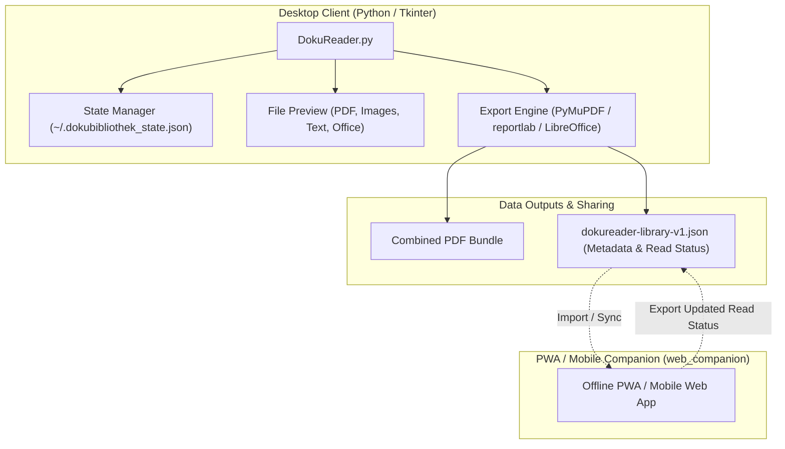
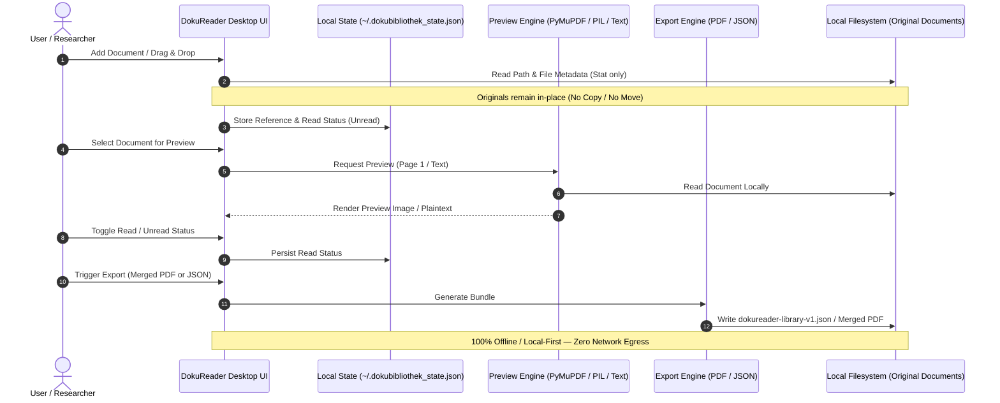
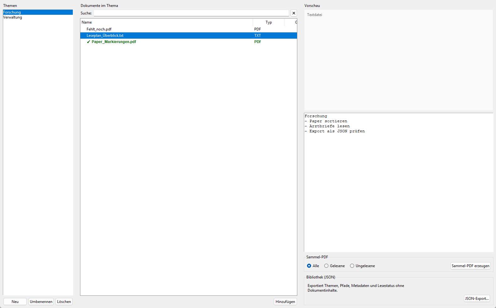

# DokuReader — Local Document Library

**🇬🇧 English** · **[🇩🇪 Deutsch](README_de.md)**

> Organize, preview, and bundle local documents by topic — references and read status only, originals stay put.

[](LICENSE)
[](CHANGELOG.md#unreleased)
[](pyproject.toml)
[](DokuReader.py)
[](#start-here)
[](pyproject.toml)
[](PRIVACY_POLICY.md)
[](SECURITY.md)
[](llms.txt)
[](https://github.com/doc-bricks)
[](https://github.com/open-bricks)


> [!NOTE]
> DokuReader is part of the **doc-bricks** local document management suite. It works seamlessly alongside [LitZentrum](https://github.com/doc-bricks/LitZentrum) (citation & literature management), [CleanMarkdown](https://github.com/doc-bricks/CleanMarkdown) (Markdown reading & editing), and [UniversalDocsGrabber](https://github.com/doc-bricks/UniversalDocsGrabber) (mail attachment intake). DokuReader is fully indexed for AI/LLM coding assistants via [`llms.txt`](llms.txt).

DokuReader is a local desktop application for organizing, previewing, and bundling documents by topic. Original files stay where they are; the application stores only file references and read status in a local JSON state file.

It is designed for private document libraries, research folders, PDF collections, and topic-based reading queues that should remain local and inspectable.

## Start Here

| Goal | Entry point |
|---|---|
| Run the desktop app | `python DokuReader.py` or `START.bat` |
| Understand the export format | `EXPORTFORMAT.md` |
| Test the desktop source build | `python tests/source_platform_smoke.py` |
| Check the mobile/PWA companion smoke | `web_companion/README.md` |
| Check Windows Store readiness | `python _WARTUNG/check_store_readiness.py --allow-blockers` |
| Prepare or parse WACK reports | `python _WARTUNG/run_windows_wack.py --dry-run` |
| Prepare Windows Store copy | `STORE_LISTING.md`, `PRIVACY_POLICY.md`, `SUPPORT.md` |
| Give LLM tools project context | `llms.txt` |

## Version and release status

The version roles are intentionally separate and read back from the current
source tree: the development runtime is `1.0.1-dev` (`DokuReader.py` and
`pyproject.toml` `1.0.1.dev0`), the Windows Store package metadata is `1.0.1.0`
(`store_package.json`), and there is no verified public release artifact in
this repository. The ignored `releases/` tree, signing, MSIX, WACK and Store
submission remain external gates; the `1.0.1-dev` badge is not a release claim.
See [RELEASE_STATUS.md](RELEASE_STATUS.md) and [PORTIERUNGSPLAN.md](PORTIERUNGSPLAN.md).

## Discovery Context

DokuReader is best described as a local-first document library, topic-based PDF organizer, reading-state tracker, and metadata-only document export tool. It is not a cloud document manager, hosted OCR service, general note-taking app, or full literature-citation suite.

Useful search phrases include `local-first document library`, `topic based PDF organizer`, `document read status tracker`, `metadata-only document export`, `Tkinter document manager`, and `offline PDF bundling desktop app`.

## Workflow Fit

| Need | Use DokuReader for |
|---|---|
| Build a reading queue | Group PDFs, Office files, text files, and images by topic without moving originals |
| Track review progress | Mark documents read or unread and filter exports by that state |
| Share a library outline | Export `dokureader-library-v1.json` with paths, metadata, topics, and read status |
| Prepare a local PDF bundle | Merge selected read, unread, or all documents into one PDF |

Within the doc-bricks family, DokuReader is the private reading-library layer. `LitZentrum` is the citation and literature-management layer, `CleanMarkdown` is the Markdown reading/editing layer, and `UniversalDocsGrabber` is the mail-attachment intake layer.

## System Architecture


```mermaid
graph TD
    subgraph Desktop ["Desktop Client (Python / Tkinter)"]
        UI["DokuReader.py"]
        State["State Manager (~/.dokubibliothek_state.json)"]
        Preview["File Preview (PDF, Images, Text, Office)"]
        Exporter["Export Engine (PyMuPDF / reportlab / LibreOffice)"]
        UI --> State
        UI --> Preview
        UI --> Exporter
    end

    subgraph Output ["Data Outputs & Sharing"]
        Exporter --> PDFBundle["Combined PDF Bundle"]
        Exporter --> JSONExport["dokureader-library-v1.json (Metadata & Read Status)"]
    end

    subgraph Companion ["PWA / Mobile Companion (web_companion)"]
        JSONExport -. Import / Sync .-> CompanionPWA["Offline PWA / Mobile Web App"]
        CompanionPWA -. Export Updated Read Status .-> JSONExport
    end
```

## Data Intake & Privacy Isolation Flow


```mermaid
sequenceDiagram
    autonumber
    actor User as User / Researcher
    participant UI as DokuReader Desktop UI
    participant State as Local State (~/.dokubibliothek_state.json)
    participant Preview as Preview Engine (PyMuPDF / PIL / Text)
    participant Exporter as Export Engine (PDF / JSON)
    participant LocalDisk as Local Filesystem (Original Documents)

    User->>UI: Add Document / Drag & Drop
    UI->>LocalDisk: Read Path & File Metadata (Stat only)
    Note over UI,LocalDisk: Originals remain in-place (No Copy / No Move)
    UI->>State: Store Reference & Read Status (Unread)
    User->>UI: Select Document for Preview
    UI->>Preview: Request Preview (Page 1 / Text)
    Preview->>LocalDisk: Read Document Locally
    Preview-->>UI: Render Preview Image / Plaintext
    User->>UI: Toggle Read / Unread Status
    UI->>State: Persist Read Status
    User->>UI: Trigger Export (Merged PDF or JSON)
    UI->>Exporter: Generate Bundle
    Exporter->>LocalDisk: Write dokureader-library-v1.json / Merged PDF
    Note over UI,LocalDisk: 100% Offline / Local-First — Zero Network Egress
```

## Features

- Create, rename, and delete document topics
- Mark documents as read or unread
- Preview images, PDFs, text files, and DOCX/ODT documents
- Text preview and TXT-to-PDF export with UTF-8 and Latin-1 fallback
- Add files via drag and drop when `tkinterdnd2` is installed
- Open original documents in the default application with a double-click
- Export all, read, or unread documents as a combined PDF
- Export the full library as `dokureader-library-v1.json`
- Convert Office documents to PDF through LibreOffice or Microsoft Word
- Build a local Windows executable through the PyInstaller spec

## Privacy And Local Data

- DokuReader runs locally and does not upload documents to external services.
- Original files are not copied or modified.
- State is stored in `~/.dokubibliothek_state.json`.
- The standard JSON export contains topics, paths, file metadata, and read status, but no document contents.
- Local build artifacts, release files, internal task notes, and conversion scratch files are excluded via `.gitignore`.

## Screenshot



## Installation

### Requirements

- Python 3.10+
- Tkinter, usually included with standard Python installations

### Python Dependencies

```bash
pip install -r requirements.txt
```

`requirements.txt` includes the supported Python integrations for preview, drag and drop, and PDF export. Missing optional packages only disable the related extra feature.

### Optional System Dependencies

For full preview and export functionality:

- LibreOffice for DOC/DOCX/ODT/RTF to PDF conversion
- Poppler for the optional `pdf2image` preview backend
- Microsoft Word on Windows for optional Word-COM conversion

## Usage

```bash
python DokuReader.py
```

On Windows, the start file can be used instead:

```bash
START.bat
```

For companion export, use the `Bibliothek (JSON)` section on the right side of the app. It writes topics, paths, file metadata, and read status to `dokureader-library-v1.json` without copying document contents. The format is documented in `EXPORTFORMAT.md`.

## Optional Windows Build

```bash
build_exe.bat
```

Build output under `build/`, `dist/`, and `releases/` stays local and does not belong in the Git repository. The build uses a local work directory under `C:\_Local_DEV\codex_build\dokureader` and updates `dist\DokuReader.exe`.

## Windows Store Readiness

```bash
python _WARTUNG/check_store_readiness.py --allow-blockers
```

The check validates Store metadata, public privacy/support URLs, required documents, Store assets, generated screenshots, a local EXE, and the remaining MSIX/WACK artifacts. `--allow-blockers` is intended for local pre-submission runs where Partner Center, MSIX signing, or the elevated WACK pass are still external gates.

The WACK runner keeps the elevated certification step reproducible:

```bash
python _WARTUNG/run_windows_wack.py --dry-run
```

The dry run prints the expected MSIX path, XML report path, discovered `appcert.exe`, and the exact certification command. The real run must happen in an elevated PowerShell after a fresh signed MSIX exists. Existing XML reports can be converted to the JSON summary that the readiness gate reads:

```bash
python _WARTUNG/run_windows_wack.py --parse-report releases/windowsstore/test_reports/wack_YYYYMMDD_HHMMSS.xml
```

## Platform Strategy

The desktop app remains the authoritative local library. Windows Store is the first distribution target; macOS and Linux are tracked as source and smoke-test targets from the same Tkinter codebase. For Android, iOS, and browser use, a later Web/PWA companion based on `dokureader-library-v1.json` is more appropriate than a full native clone because mobile sandboxes cannot freely access local desktop document paths.

The reproducible desktop source smoke lives in `tests/source_platform_smoke.py`. It covers app start, `open`/`xdg-open` dispatch, text and PDF preview, simulated LibreOffice conversion, and merged PDF export without touching real user state.

The mobile companion now also has a reproducible PWA smoke under
`web_companion/`: `npm test` validates manifest metadata, offline-shell assets,
and the demo library for Android/iOS-style install flows without introducing a
native duplicate app line.

## Supported File Formats

- Documents: `.txt`, `.doc`, `.docx`, `.pdf`, `.odt`, `.rtf`
- Images: `.jpg`, `.jpeg`, `.gif`, `.png`

## Project Files

- `DokuReader.py` - main application
- `requirements.txt` - Python dependencies
- `DokuReader.spec` - PyInstaller configuration
- `EXPORTFORMAT.md` - schema for `dokureader-library-v1.json`
- `_WARTUNG/check_store_readiness.py` - Windows Store readiness gate
- `_WARTUNG/run_windows_wack.py` - WACK dry-run, execution, and XML-to-JSON summary helper
- `web_companion/README.md` - PWA/mobile smoke workflow for Android and iOS
- `STORE_LISTING.md` - Windows Store copy in German and English
- `PRIVACY_POLICY.md` - privacy notes for the Store release
- `SUPPORT.md` - support and contact paths
- `llms.txt` - machine-readable project context
- `locales/translations.json` - translation data
- `THIRD_PARTY_LICENSES.txt` - third-party license summary
- `SECURITY.md` - vulnerability reporting guidance
- `CONTRIBUTING.md` - contribution guidelines

## Ecosystem & Sibling Tools

DokuReader is part of the **doc-bricks** family under the **open-bricks** open-source initiative, designed for seamless offline-first document and knowledge workflows:

| Repository | Focus | Role in Suite |
|---|---|---|
| **[LitZentrum](https://github.com/doc-bricks/LitZentrum)** | Literature & Citations | Academic paper library, BibTeX export, and citation management |
| **[CleanMarkdown](https://github.com/doc-bricks/CleanMarkdown)** | Markdown Studio | Focused Markdown reader, editor, and typography cleaner |
| **[UniversalDocsGrabber](https://github.com/doc-bricks/UniversalDocsGrabber)** | Document Intake | Automated mail attachment extraction and local sorting |
| **[UniversalInvoiceMail](https://github.com/doc-bricks/UniversalInvoiceMail)** | Invoice Mail Extraction | Deterministic invoice attachment detection and extraction |
| **[UniversalMailCleaner](https://github.com/doc-bricks/UniversalMailCleaner)** | Mail Hygiene | Local mail archive cleaning, duplicate removal, and sanitization |
| **[MailProcessor](https://github.com/doc-bricks/MailProcessor)** | Mail Processing | Rule-based local mail routing, filtering, and document triage |
| **[PDFtoPDFocr](https://github.com/doc-bricks/PDFtoPDFocr)** | PDF OCR Processing | Searchable sandwich PDF creation with local Tesseract OCR |
| **[MediaBrain](https://github.com/doc-bricks/MediaBrain)** | Media Asset Organizer | Visual media tagging, categorization, and metadata indexing |
| **[DokuZen](https://github.com/doc-bricks/DokuZen)** | Distraction-Free Docs | Minimalist zen reading and document inspection environment |
| **[ProFiler](https://github.com/file-bricks/ProFiler)** | Multi-Tool File Analysis | Deep file inspector, structural parser, and metadata profiler |
| **[ExplorerPro](https://github.com/file-bricks/ExplorerPro)** | Advanced File Explorer | High-performance multi-pane local file manager |
| **[DevCenter](https://github.com/dev-bricks/DevCenter)** | Developer Workspace | Central developer dashboard and project management hub |
| **[CodeBox](https://github.com/dev-bricks/CodeBox)** | Code Snippet Vault | Offline-first code snippet organizer with syntax highlighting |
| **[open-bricks](https://github.com/open-bricks)** | Umbrella Architecture | Master ecosystem coordination for desktop productivity |

## License

This project is licensed under the [GNU Affero General Public License v3.0](LICENSE). AGPL-3.0 is appropriate because DokuReader can optionally use PyMuPDF, which is also licensed under AGPL-3.0.

## Liability

This project is provided without warranty. Use, testing, and processing of your own documents are at your own risk. The warranty and liability disclaimers of AGPL-3.0 apply.
