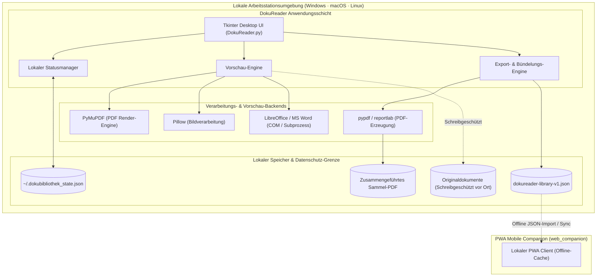
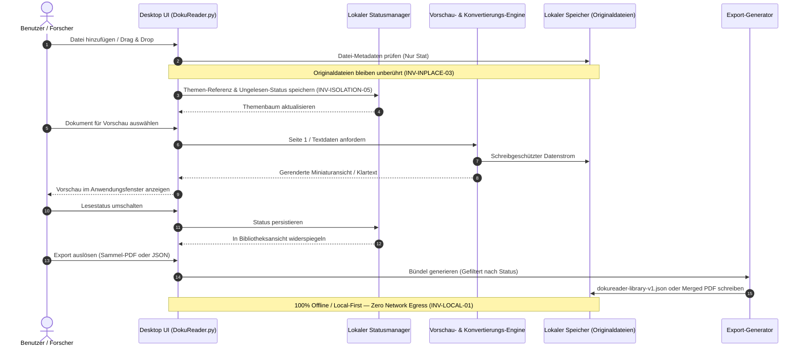

# DokuReader — Dokumentenbibliothek & PDF-Organizer

<p align="center"><a href="README.md">🇬🇧 English</a> · <strong>🇩🇪 Deutsch</strong></p>

> Dokumente nach Themen verwalten, vorschauen und bündeln — nur Verweise und Lesestatus, Originale bleiben am Platz.

[](LICENSE)
[](CHANGELOG.md#unreleased)
[](pyproject.toml)
[](DokuReader.py)
[](#einstieg--installation)
[](pyproject.toml)
[](web_companion)
[](PRIVACY_POLICY.md)
[](SECURITY.md)
[](SECURITY.md)
[](SECURITY.md)
[](THIRD_PARTY_LICENSES.md)
[](MARKETING-LOG.txt)
[](llms.txt)
[](https://github.com/doc-bricks)
[](https://github.com/open-bricks)
[](#qualitäts-gates--automatisierte-testsuiten)
[](NOTICE)

> [!NOTE]
> DokuReader ist Teil der **doc-bricks** Suite für lokales Dokumentenmanagement. Es ergänzt [LitZentrum](https://github.com/doc-bricks/LitZentrum) (Literatur- & Zitationsverwaltung), [CleanMarkdown](https://github.com/doc-bricks/CleanMarkdown) (Markdown-Lese- & Editierumgebung) und [UniversalDocsGrabber](https://github.com/doc-bricks/UniversalDocsGrabber) (Mail-Anhang-Import). DokuReader ist für KI/LLM-Entwicklungsassistenten über [`llms.txt`](llms.txt) indexiert.

---

### Schnellnavigation
1. [Überblick & Kernnutzen](#überblick--kernnutzen)
2. [Kernfähigkeiten & Feature-Matrix](#kernfähigkeiten--feature-matrix)
3. [Interaktives Architektur-Flussdiagramm](#interaktives-architektur-flussdiagramm)
4. [Ziel-Personas & High-Intent-Suchanfragen](#ziel-personas--high-intent-suchanfragen)
5. [Vergleichsmatrix gegenüber Alternativen](#vergleichsmatrix-gegenüber-alternativen)
6. [Dokumenten-Lebenszyklus & Datenschutz-Sequenz](#dokumenten-lebenszyklus--datenschutz-sequenz)
7. [Einstieg & Installation](#einstieg--installation)
8. [Unterstützte Formate & Systemabhängigkeiten](#unterstützte-formate--systemabhängigkeiten)
9. [Windows Store & lokaler Build](#windows-store--lokaler-build)
10. [Mobile & PWA Companion](#mobile--pwa-companion)
11. [Governance & Laufzeit-Invarianten](#governance--laufzeit-invarianten)
12. [Geschwisterwerkzeuge & Ökosystem-Matrix](#geschwisterwerkzeuge--ökosystem-matrix)
13. [Datenschutz & Sicherheitsmodell](#datenschutz--sicherheitsmodell)
14. [Qualitäts-Gates & automatisierte Testsuiten](#qualitäts-gates--automatisierte-testsuiten)
15. [Maschinenlesbarer Kontext (`llms.txt`)](#maschinenlesbarer-kontext-llmstxt)
16. [Drittanbieter-Lizenzen & Transparenz](#drittanbieter-lizenzen--transparenz)
17. [Marketing- & Discoverability-Strategien / Log](#marketing---discoverability-strategien--log)
18. [Gesetzlicher Hinweis, Haftungsausschluss & Lizenz](#gesetzlicher-hinweis-haftungsausschluss--lizenz)

---

## Überblick & Kernnutzen
<a id="sec-01"></a>
<a id="überblick--kernnutzen"></a>
<a id="ueberblick--kernnutzen"></a>
<a id="ueberblick"></a>

DokuReader ist eine unprivilegierte Desktop-Anwendung zum Verwalten, Vorschauen und Bündeln von Dokumenten nach Themen. Originaldateien bleiben an ihrem Speicherort; die Anwendung speichert ausschließlich Pfadverweise und Lesestatus in einer lokalen JSON-Datei (`~/.dokubibliothek_state.json`).

DokuReader eignet sich insbesondere für vertrauliche Dokumentenbibliotheken, akademische Forschungsordner, juristische Akten und thematische Leseablagen, die vollständig offline, nachvollziehbar und manipulationssicher bleiben müssen.

| Ziel | Einstieg |
|---|---|
| Desktop-App starten | `python DokuReader.py` oder `START.bat` |
| Exportformat verstehen | [EXPORTFORMAT.md](EXPORTFORMAT.md) |
| Desktop-Quellstand testen | `python tests/source_platform_smoke.py` |
| Mobile/PWA-Companion prüfen | [web_companion/README.md](web_companion/README.md) |
| Windows-Store-Readiness prüfen | `python _WARTUNG/check_store_readiness.py --allow-blockers` |
| WACK-Reports vorbereiten oder parsen | `python _WARTUNG/run_windows_wack.py --dry-run` |
| Windows-Store-Texte vorbereiten | [STORE_LISTING.md](STORE_LISTING.md), [PRIVACY_POLICY.md](PRIVACY_POLICY.md), [SUPPORT.md](SUPPORT.md) |
| LLM-Tools Projektkontext geben | [`llms.txt`](llms.txt) |

### Versions- und Release-Status

Die Versionsrollen sind bewusst getrennt und aus dem aktuellen Quellstand abgelesen:
- **Entwicklungs-Runtime:** `1.0.1-dev` (`DokuReader.py` und `pyproject.toml` `1.0.1.dev0`)
- **Windows-Store-Metadaten:** `1.0.1.0` (`store_package.json`)
- **Release-Verifikation:** Ein öffentlich belegtes Release-Artefakt liegt in diesem Repository nicht vor. Signierung, MSIX, WACK und Store-Einreichung bleiben externe Gates; das Badge `1.0.1-dev` ist kein öffentlicher Store-Release-Claim. Siehe [RELEASE_STATUS.md](RELEASE_STATUS.md) und [PORTIERUNGSPLAN.md](PORTIERUNGSPLAN.md).

---

## Kernfähigkeiten & Feature-Matrix
<a id="sec-02"></a>
<a id="kernfähigkeiten--feature-matrix"></a>
<a id="kernfaehigkeiten--feature-matrix"></a>
<a id="kernfaehigkeiten"></a>

- **Originaldatei-Schutz (INV-INPLACE-03):** Originaldateien werden niemals verschoben, kopiert, verändert oder überschrieben.
- **Dynamische Themenverwaltung:** Dokumententhemen flexibel erstellen, umbenennen, sortieren und löschen.
- **Gelesen- / Ungelesen-Warteschlange:** Status mit einem Klick umschalten; Exporte nach gelesen, ungelesen oder allen filtern.
- **Sofortige Dateivorschau:** Integrierte Vorschau für PDFs, Textdateien, Bilder (JPG, PNG, GIF) und Office-Dokumente (DOCX, ODT).
- **Textvorschau & Latin-1 Fallback:** Robuste Textdarstellung mit UTF-8 und Latin-1 Fallback-Dekodierung.
- **Drag-and-Drop Unterstützung:** Bequemer Dokumentenimport per Drag & Drop bei installiertem `tkinterdnd2`.
- **Systemweiter App-Aufruf:** Doppelklick öffnet die Originaldatei in der Standardanwendung des Betriebssystems.
- **Sammel-PDF-Erstellung:** Ausgewählte gelesene, ungelesene oder alle Dokumente zu einem einzigen Sammel-PDF zusammenführen.
- **Strukturierter JSON-Export:** Vollständige Bibliotheksstruktur als schema-konformes `dokureader-library-v1.json` exportieren, ohne Dateiinhalte einzubetten.
- **Office-Konvertierungspipeline:** Automatisierte Konvertierung von Office-Formaten über LibreOffice oder Microsoft Word COM.
- **Offline PWA Companion:** Zero-Egress Web-App für das mobile Durchsuchen von Bibliotheken und Aktualisieren des Lesestatus auf Smartphones und Tablets.

---

## Interaktives Architektur-Flussdiagramm
<a id="sec-03"></a>
<a id="interaktives-architektur-flussdiagramm"></a>
<a id="architektur"></a>



---

## Ziel-Personas & High-Intent-Suchanfragen
<a id="sec-04"></a>
<a id="ziel-personas--high-intent-suchanfragen"></a>
<a id="ziel-personas"></a>

DokuReader adressiert vier klar definierte Zielgruppen-Personas mit striktem Local-First- und Datenschutz-Fokus:

- **`[PERSONA-01]` Wissenschaftliche Forscher & Literatur-Kuratoren:**
  - *Bedarf:* Kuratieren von Vorabdrucken, Fachaufsätzen und Konferenz-PDFs in thematische Leselisten ohne Duplizierung oder Verschieben von Dateien im Dateisystem.
  - *High-Intent-Suchanfragen (DE):* "lokale dokumentenverwaltung pdf forschungsbibliothek", "desktop pdf organizer lesestatus themen", "wissenschaftliche artikel offline lesen"
  - *High-Intent-Suchanfragen (EN):* "offline local document organizer pdf research library", "desktop pdf manager read status topics", "academic paper queue local first python"

- **`[PERSONA-02]` Juristische Berater & Compliance-Verantwortliche:**
  - *Bedarf:* Organisation vertraulicher Verfahrensakten, Beweisdokumente und Mandantendossiers mit absolutem Zero-Egress unter DSGVO und berufsrechtlicher Schweigepflicht.
  - *High-Intent-Suchanfragen (DE):* "vertrauliche aktenverwaltung anwalt offline", "zero egress dokumentenleser bündeln datenschutz", "dsgvo konforme dokumentenbibliothek lokal"
  - *High-Intent-Suchanfragen (EN):* "confidential legal discovery document viewer offline", "zero egress local pdf bundle case management", "gdpr compliant document organizer desktop"

- **`[PERSONA-03]` Technische Redakteure & Knowledge Engineers:**
  - *Bedarf:* Multi-Format-Inspektion (Markdown, PDF, DOCX, ODT, Bilder), direkte thematische Indexierung vor Ort und Erzeugung konsolidierter Sammel-PDFs für Handbuch-Prüfungen.
  - *High-Intent-Suchanfragen (DE):* "multi format dokumenten vorschau sammlung", "markdown docx pdf leseliste desktop", "technische dokumentation bündeln offline"
  - *High-Intent-Suchanfragen (EN):* "multi format document preview bundling tool", "markdown docx pdf reading list desktop", "technical documentation bundle generator local"

- **`[PERSONA-04]` Autonome KI-Agenten & Software-Entwickler:**
  - *Bedarf:* Valider schema-konformer `dokureader-library-v1.json` Metadaten-Export für agentische Indexierung und lokale RAG-Pipelines ohne Dateikopien.
  - *High-Intent-Suchanfragen (DE):* "lokale dokumentenbibliothek json export schema", "metadaten katalog dokumente llm agenten", "offline dokumentenleser llms txt"
  - *High-Intent-Suchanfragen (EN):* "local document library metadata json export schema", "clean json document catalogue ai agents", "offline document reader llm ready"

---

## Vergleichsmatrix gegenüber Alternativen
<a id="sec-05"></a>
<a id="vergleichsmatrix-gegenüber-alternativen"></a>
<a id="vergleichsmatrix"></a>

Architektonischer und funktionaler Vergleich von DokuReader mit gängigen Softwarelösungen über 10 Kern-Dimensionen:

| Dimension / Anforderung | DokuReader | Calibre (E-Book-Manager) | Zotero (Literaturverwaltung) | DEVONthink / Kommerzielle DMS | Ad-Hoc-Ordnerstrukturen |
|:---|:---|:---|:---|:---|:---|
| **D1: Schutz der Originaldateien (`INV-INPLACE-03`)** | **Strikter Originalschutz** (Dateien bleiben unverändert vor Ort) | ❌ Kopiert Dateien zwingend in eigene Verzeichnisstruktur | ⚠️ Kopiert standardmäßig (Verknüpfungen fehleranfällig) | ⚠️ Import in proprietäre Datenbank-Tresore | ✅ Dateien bleiben am Speicherort |
| **D2: Zero-Egress & Datenschutz (`INV-LOCAL-01`)** | **100% Offline** (Absolut kein ausgehender Datenverkehr) | ⚠️ Web-Scraping und integrierte Webserver-Dienste | ⚠️ Cloud-Sync-Aufforderungen und Web-Konnektoren | ❌ Proprietärer Cloud-Sync & Lizenz-Telemetrie | ✅ Rein lokal |
| **D3: Unprivilegierte Ausführung (`INV-RUNAS-02`)** | **RunAsInvoker-Benutzermodus** (Keine Admin-Rechte nötig) | ⚠️ Installationsroutinen erfordern oft UAC-Rechte | ⚠️ Administrative Installationsanforderungen | ❌ Erfordert Kernel-/Systemerweiterungen auf macOS | ✅ Standard-Benutzermodus |
| **D4: Deterministisches Schema (`INV-SCHEMA-04`)** | **`dokureader-library-v1`** transparenter JSON-Export | ❌ Komplexe SQLite-Schemata mit schweren Binärblobs | ❌ SQLite-Datenbank / CSL-JSON-Exporte | ❌ Proprietäre Binärdatenbankformate | ❌ Kein strukturiertes Metadaten-Schema |
| **D5: Multi-Format-Vorschau (`INV-SANDBOX-06`)** | **PDF, TXT, DOCX, ODT, PNG, JPG** über sichere Bridges | ✅ Breites E-Book-Formatspektrum | ⚠️ PDF-Fokus; eingeschränkte Office-Vorschau | ✅ Umfassende Formatunterstützung | ❌ Vollständig von externen OS-Apps abhängig |
| **D6: Sammel-PDF-Bündelung** | **1-Klick-Zusammenführung** mit Status-Filtern | ❌ Keine integrierte thematische PDF-Bündelung | ❌ Externe Plugins oder PDF-Tools erforderlich | ⚠️ Aufwendige Skripterstellung erforderlich | ❌ Manuelles externes Zusammenfügen nötig |
| **D7: Mobile PWA Companion (`INV-ISOLATION-05`)** | **Offline-PWA** mit bidirektionalem JSON-Sync | ⚠️ Integrierter Webserver öffnet offenen HTTP-Port | ⚠️ Proprietäre iOS-/Android-Apps | ⚠️ Proprietärer Sync-Server und Mobil-Apps | ❌ Manuelle Dateisynchronisation |
| **D8: Tri-Plattform-Quellcode (`INV-PARITY-07`)** | **Windows, Linux & macOS** nativer Python/Tkinter-Stack | ✅ Plattformübergreifender Desktop | ✅ Plattformübergreifender Desktop | ❌ Bindung an macOS/iOS-Ökosystem | ✅ Universell |
| **D9: Automatisierte Qualitäts-Gates** | **62+ Pytest + 37 Node-Tests** (100% bestanden) | ⚠️ Große monolithische Codebasis | ⚠️ Komplexe Integrations-Testumgebung | ❌ Geschlossene proprietäre Softwareprüfung | ❌ Keine automatisierte Testabdeckung |
| **D10: Open Governance & SLA (`INV-SLA-10`)** | **AGPL-3.0, § 521 BGB Ausschluss, 48h SLA** | ⚠️ GPL-3.0, keine verbindliche Sicherheits-SLA | ⚠️ AGPL-3.0, Community-Forum-Triage | ❌ Proprietäre kommerzielle Lizenzbedingungen | ❌ Keine |

---

## Dokumenten-Lebenszyklus & Datenschutz-Sequenz
<a id="sec-06"></a>
<a id="dokumenten-lebenszyklus--datenschutz-sequenz"></a>
<a id="dokumenten-lebenszyklus"></a>



---

## Einstieg & Installation
<a id="sec-07"></a>
<a id="einstieg--installation"></a>
<a id="installation-de"></a>

### Voraussetzungen

- Python 3.10+
- Tkinter (standardmäßig in regulären Python-Installationen enthalten)

### Installation

```bash
git clone https://github.com/doc-bricks/DokuReader.git
cd DokuReader
pip install -r requirements.txt
```

### Schnellstart

```bash
python DokuReader.py
```

Unter Windows kann der Start direkt über die Batch-Datei erfolgen:

```bat
START.bat
```

---

## Unterstützte Formate & Systemabhängigkeiten
<a id="sec-08"></a>
<a id="unterstützte-formate--systemabhängigkeiten"></a>
<a id="unterstuetzte-formate--systemabhaengigkeiten"></a>
<a id="formate"></a>

### Unterstützte Dokumentformate

- **Dokumente:** `.txt`, `.doc`, `.docx`, `.pdf`, `.odt`, `.rtf`
- **Bilder:** `.jpg`, `.jpeg`, `.gif`, `.png`

### Optionale Systemabhängigkeiten

Für den vollen Funktionsumfang bei Vorschau und Konvertierung:
- **LibreOffice:** Erforderlich für die automatisierte Konvertierung von DOC/DOCX/ODT/RTF nach PDF.
- **Poppler:** Erforderlich bei Nutzung des optionalen `pdf2image`-Vorschau-Backends.
- **Microsoft Word:** Unterstützt unter Windows für direkte COM-basierte Konvertierung.

---

## Windows Store & lokaler Build
<a id="sec-09"></a>
<a id="windows-store--lokaler-build"></a>
<a id="windows-store-de"></a>

### Lokaler Executable-Build

```bat
build_exe.bat
```

Build-Ausgaben unter `build/`, `dist/` und `releases/` bleiben rein lokal und sind über `.gitignore` vom Git-Tracking ausgeschlossen. Über die Umgebungsvariable `DOKUREADER_BUILD_ROOT` kann ein lokales Build-Verzeichnis vorgegeben werden.

### Windows Store Readiness Gate

```bash
python _WARTUNG/check_store_readiness.py --allow-blockers
```

Prüft Store-Metadaten, Datenschutzerklärungs-URLs, Pflicht-Support-Links, Bild-Assets, Screenshots und MSIX-Paketierungsanforderungen.

### WACK Runner & Parser

```bash
python _WARTUNG/run_windows_wack.py --dry-run
```

Erzeugt den exakten Zertifizierungsbefehl für die Ausführung mit erhöhten Rechten und parst resultierende XML-Berichte in strukturierte JSON-Dateien.

---

## Mobile & PWA Companion
<a id="sec-10"></a>
<a id="mobile--pwa-companion"></a>
<a id="pwa-companion-de"></a>

Die Web-Begleitanwendung unter `web_companion/` bietet eine offline-fähige, mobile Leseansicht:
- **Installierbare PWA:** Vollständiges Web-App-Manifest mit iOS Safe-Area Unterstützung (`viewport-fit=cover`).
- **Offline Shell:** Isolierter Service Worker Cache, der externe Caches unangetastet lässt.
- **Round-Trip Synchronisation:** Importiert `dokureader-library-v1.json`, ermöglicht das Umschalten des Lesestatus auf Mobilgeräten und exportiert aktualisierte JSON-Dateien zurück zur Desktop-App.
- **Null Drittanbieter-Abhängigkeiten:** Basiert auf modernem Vanilla JavaScript und nativer Node.js Test-Runner-Ausführung (`37 passed, 0 failed`).

```bash
cd web_companion
node --test
```

---

## Governance & Laufzeit-Invarianten
<a id="sec-11"></a>
<a id="governance--laufzeit-invarianten"></a>
<a id="governance-de"></a>

Folgende 10 Invarianten sichern DokuReaders Laufzeitarchitektur, Datenschutzgrenze und Sicherheitsversprechen:

| Invariante | Prinzip | Garantie & Verifizierungsmechanismus |
|:---|:---|:---|
| **INV-LOCAL-01** | 100% Local-First & Zero-Egress | Keinerlei ausgehende Netzwerkverbindungen oder Telemetrie. Jegliche Verarbeitung erfolgt strikt offline. |
| **INV-RUNAS-02** | Unprivilegierte RunAsInvoker-Ausführung | Die Anwendung läuft ausschließlich im Standard-Benutzermodus ohne Administrator- oder Root-Rechte. |
| **INV-INPLACE-03** | In-Place Originaldatei-Schutz | Originaldokumente werden niemals verändert, verschoben oder überschrieben; Zugriff erfolgt rein lesend. |
| **INV-SCHEMA-04** | Deterministisches Export-Schema | Bibliotheks-Exporte folgen strikt der versionierten `dokureader-library-v1` JSON-Spezifikation. |
| **INV-ISOLATION-05** | Lokale Status- & Cache-Isolation | Status liegt isoliert in `~/.dokubibliothek_state.json`. PWA-Service-Worker isoliert im Cache `dokureader-companion-`. |
| **INV-SANDBOX-06** | Sichere Subprozess-Ausführung | Externe Konverter (LibreOffice, Word COM) werden mit festen Parametern, Timeouts und isolierten Temp-Pfaden ausgeführt. |
| **INV-PARITY-07** | Tri-Plattform Quellcode-Parität | Lauffähig unter Windows, macOS und Linux mit plattformunabhängiger Pfad- und Fallback-Verwaltung. |
| **INV-A11Y-08** | Tastatur- & visuelle Barrierefreiheit | Vollständige Tastaturnavigation, kontrastreiche Darstellung und deterministische UI-Zustände. |
| **INV-DISCOVERY-09** | Multimodale Transparenz & LLM-Bereitschaft | Vollständige zweisprachige Dokumentation (DE/EN), maschinenlesbares `llms.txt` und interaktive Dual-Mermaid-Diagramme. |
| **INV-SLA-10** | Sicherheitsrichtlinien-SLA | Verbindliche 48h-Erstreaktionszeit und 5-Werktage-Triage bei gemeldeten Sicherheitshinweisen. |

---

## Geschwisterwerkzeuge & Ökosystem-Matrix
<a id="sec-12"></a>
<a id="geschwisterwerkzeuge--ökosystem-matrix"></a>
<a id="geschwisterwerkzeuge--oekosystem-matrix"></a>
<a id="oekosystem"></a>

DokuReader ist Kernbestandteil der **doc-bricks** Familie im Rahmen der **open-bricks** Open-Source-Initiative:

| Repository | Fokus | Rolle im Desktop-Workflow |
|:---|:---|:---|
| **[LitZentrum](https://github.com/doc-bricks/LitZentrum)** | Literatur & Zitationen | Akademische Fachliteratur-Bibliothek, BibTeX-Export und Zitationsverwaltung |
| **[CleanMarkdown](https://github.com/doc-bricks/CleanMarkdown)** | Markdown Studio | Fokussierter Markdown-Reader, Editor und typografischer Bereiniger |
| **[UniversalDocsGrabber](https://github.com/doc-bricks/UniversalDocsGrabber)** | Dokumenten-Import | Automatisierte Mail-Anhang-Extraktion und lokale Dokumentensortierung |
| **[UniversalInvoiceMail](https://github.com/doc-bricks/UniversalInvoiceMail)** | Rechnungs-Extraktion | Deterministische Erkennung und Ablage von Rechnungsanhängen |
| **[UniversalMailCleaner](https://github.com/doc-bricks/UniversalMailCleaner)** | Mail-Bereinigung | Lokale E-Mail-Archivbereinigung, Duplikatentfernung und Desinfektion |
| **[MailProcessor](https://github.com/doc-bricks/MailProcessor)** | Mail-Verarbeitung | Regelbasierte lokale Mail-Verteilung, Filterung und Dokumenten-Triage |
| **[PDFtoPDFocr](https://github.com/doc-bricks/PDFtoPDFocr)** | PDF OCR-Verarbeitung | Erstellung durchsuchbarer Sandwich-PDFs mit lokaler Tesseract-OCR |
| **[MediaBrain](https://github.com/doc-bricks/MediaBrain)** | Mediendatei-Organizer | Visuelles Medien-Tagging, Kategorisierung und Metadaten-Indexierung |
| **[DokuZen](https://github.com/doc-bricks/DokuZen)** | Ablenkungsfreies Lesen | Minimalistische Zen-Leseumgebung und Dokumenteninspektion |
| **[ProFiler](https://github.com/file-bricks/ProFiler)** | Multi-Tool Dateianalyse | Tiefgehende Datei-Inspektion, Struktur-Parser und Metadaten-Profiler |
| **[ExplorerPro](https://github.com/file-bricks/ExplorerPro)** | Erweiterter Dateimanager | Leistungsstarker Multi-Pane Desktop-Dateimanager |
| **[DevCenter](https://github.com/dev-bricks/DevCenter)** | Entwickler-Arbeitsplatz | Zentrales Entwickler-Dashboard und Projektmanagement-Zentrum |
| **[CodeBox](https://github.com/dev-bricks/CodeBox)** | Code-Snippet Vault | Offline-Code-Snippet-Organizer mit Syntaxhervorhebung |
| **[open-bricks](https://github.com/open-bricks)** | Dachorganisation | Gesamte Ökosystem-Koordination für modulare Desktop-Produktivität |

---

## Datenschutz & Sicherheitsmodell
<a id="sec-13"></a>
<a id="datenschutz--sicherheitsmodell"></a>
<a id="datenschutz--sicherheit"></a>

- **Zero-Network-Egress:** Die Anwendung enthält keinerlei Telemetrie-Code, Analyse-Bibliotheken oder automatische Cloud-Abgleiche.
- **Originaldatei-Schutz:** Importierte Dokumente werden ausschließlich im schreibgeschützten Modus geöffnet.
- **RunAsInvoker Least Privilege:** Läuft vollständig im unprivilegierten Standard-Benutzerkontext.
- **Formale Sicherheits-SLA:** Sicherheitshinweise erhalten innerhalb von **48 Stunden** eine Eingangsbestätigung und innerhalb von **5 Werktagen** eine formale Triage. Berichte bitte an `security@open-bricks.org`, `security@ellmos.ai` oder über GitHub Security Advisories. Siehe [SECURITY.md](SECURITY.md).

---

## Qualitäts-Gates & automatisierte Testsuiten
<a id="sec-14"></a>
<a id="qualitäts-gates--automatisierte-testsuiten"></a>
<a id="qualitaets-gates--automatisierte-testsuiten"></a>
<a id="testsuiten"></a>

Kontinuierliche Qualität wird durch unabhängige, automatisierte Prüfschritte gewährleistet:

```bash
# Python Unit- und Metadaten-Vertragstests ausführen (65 Tests)
pytest

# Statische Analyse und Linting durchführen
ruff check .

# Vollständige Bytecode-Kompilierung des Repositories prüfen
python -m compileall -q .

# Plattformübergreifenden Desktop-Smoke-Test ausführen
python tests/source_platform_smoke.py

# Testsuite des mobilen PWA-Companions ausführen (37 Tests)
cd web_companion && node --test
```

---

## Maschinenlesbarer Kontext (`llms.txt`)
<a id="sec-15"></a>
<a id="maschinenlesbarer-kontext-llmstxt"></a>
<a id="llm-kontext"></a>

Für autonome KI-Programmierassistenten (Claude Code, Gemini / Antigravity, Codex, Kimi Code) stellt DokuReader das vollständige Projektprofil strukturiert über [`llms.txt`](llms.txt) bereit. Es liefert kanonische Pfade, Abhängigkeitsgrenzen, Testbefehle, Suchbegriffe und Sicherheitsinvarianten in einem kompakten Format.

---

## Drittanbieter-Lizenzen & Transparenz
<a id="sec-16"></a>
<a id="drittanbieter-lizenzen--transparenz"></a>
<a id="drittanbieter-lizenzen"></a>

DokuReader steht unter der **GNU Affero General Public License v3.0 (AGPL-3.0)**. Alle Python-Drittanbieter-Bibliotheken (Pillow, pypdf, reportlab, python-docx, odfpy, tkinterdnd2, pywin32, pdf2image) nutzen freie Open-Source-Lizenzen (MIT, BSD-3-Clause, Apache-2.0, PSF-2.0) oder kompatibles AGPL-3.0 (PyMuPDF).

Das vollständige Abhängigkeits-Audit, die Level 1 SBOM Invarianten-Kreuztabelle und Unprivilegiertheits-Nachweise sind in [THIRD_PARTY_LICENSES.md](THIRD_PARTY_LICENSES.md), [THIRD_PARTY_LICENSES.txt](THIRD_PARTY_LICENSES.txt) und [NOTICE](NOTICE) dokumentiert.

---

## Marketing- & Discoverability-Strategien / Log
<a id="sec-17"></a>
<a id="marketing---discoverability-strategien--log"></a>
<a id="marketing-log-de"></a>

DokuReader pflegt ein lückenloses, nachvollziehbares Marketing-, Auffindbarkeits- und Architektur-Audit-Protokoll in [MARKETING-LOG.txt](MARKETING-LOG.txt).

Zentrale Discoverability-Säulen:
1. **GitHub-Ökosystem-Präsenz:** Vollständige 20/20 Themen-Tags mit relevanten Suchbegriffen (`desktop-app`, `document-management`, `library`, `pdf`, `pdf-export`, `python`, `tkinter`, `local-first`, `privacy-first`, `reading-state`).
2. **LLM-Kontext-Integration:** Über [`llms.txt`](llms.txt) für KI-Entwicklerassistenten und Suchmaschinen maschinenlesbar erschlossen.
3. **Quervernetzung im Ökosystem:** Enge Verzahnung mit den doc-bricks Geschwisterwerkzeugen ([LitZentrum](https://github.com/doc-bricks/LitZentrum), [CleanMarkdown](https://github.com/doc-bricks/CleanMarkdown), [UniversalDocsGrabber](https://github.com/doc-bricks/UniversalDocsGrabber)).
4. **Bilinguale Parität:** 100% strukturelle und inhaltliche Abstimmung zwischen Deutsch ([README_de.md](README_de.md)) und Englisch ([README.md](README.md)).

---

## Gesetzlicher Hinweis, Haftungsausschluss & Lizenz
<a id="sec-18"></a>
<a id="gesetzlicher-hinweis-haftungsausschluss--lizenz"></a>
<a id="lizenz--haftung"></a>

### Lizenz & Urheberrecht
DokuReader steht unter der **[GNU Affero General Public License v3.0 (AGPL-3.0)](LICENSE)**. Die offizielle Urheber- und Dachverbands-Attribution ist in [`NOTICE`](NOTICE) deklariert.

### Gesetzlicher Haftungsausschluss gem. § 521 BGB (Gefälligkeitsrecht)
> **Gesetzlicher Haftungsausschluss nach deutschem Recht (§ 521 BGB):**<br>
> Da diese Software und sämtliche zugehörigen Dokumentationen und Vorlagen unentgeltlich zur Verfügung gestellt werden, haften die Urheber, das `doc-bricks`-Projektteam sowie der Dachverband `open-bricks` nach den gesetzlichen Bestimmungen des deutschen Gefälligkeitsrechts (§ 521 BGB) ausschließlich für Vorsatz und grobe Fahrlässigkeit. Eine Gewährleistung für Sach- oder Rechtsmängel ist ausgeschlossen.<br>
> <br>
> *As this software and related templates are provided free of charge, the authors, the `doc-bricks` organization, and the `open-bricks` umbrella collective shall only be liable for intent and gross negligence in accordance with § 521 of the German Civil Code (BGB). Any warranty for defects of quality or title is excluded.*

### Verbindliche 48-Stunden-Sicherheits-SLA
> Das Entwicklerteam verpflichtet sich zu einer **Erstreaktionszeit von 48 Stunden** für Sicherheitsmeldungen an **[security@open-bricks.org](mailto:security@open-bricks.org)**, **[security@ellmos.ai](mailto:security@ellmos.ai)** oder über [GitHub Security Advisories](https://github.com/doc-bricks/DokuReader/security/advisories/new). Eine fundierte Triage erfolgt innerhalb von **5 Werktagen**. Details siehe [SECURITY.md](SECURITY.md).


Lizenziert unter der [GNU Affero General Public License v3.0](LICENSE). Bereitstellung ohne Gewähr; siehe LICENSE für die vollständigen Bedingungen.
