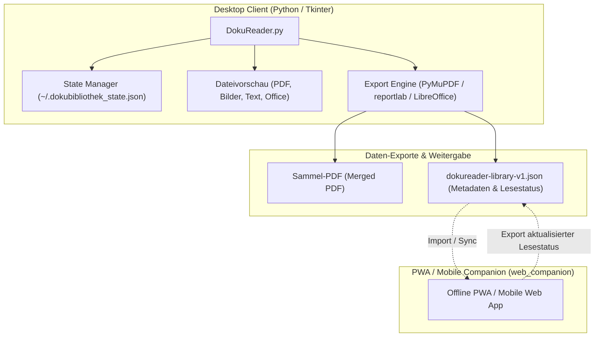
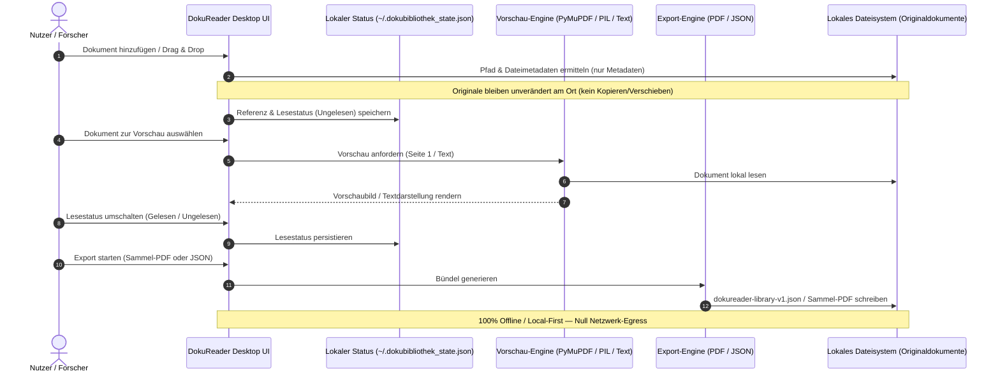

# DokuReader — Dokumentenbibliothek

**[🇬🇧 English](README.md)** · **🇩🇪 Deutsch**

> Dokumente nach Themen verwalten, vorschauen und bündeln — nur Verweise und Lesestatus, Originale bleiben am Platz.

[](LICENSE)
[](CHANGELOG.md#unreleased)
[](pyproject.toml)
[](DokuReader.py)
[](#einstieg)
[](pyproject.toml)
[](web_companion)
[](PRIVACY_POLICY.md)
[](SECURITY.md)
[](llms.txt)
[](https://github.com/doc-bricks)
[](https://github.com/open-bricks)


> [!NOTE]
> DokuReader ist Teil der **doc-bricks** Suite für lokales Dokumentenmanagement. Es ergänzt [LitZentrum](https://github.com/doc-bricks/LitZentrum) (Literatur- & Zitationsverwaltung), [CleanMarkdown](https://github.com/doc-bricks/CleanMarkdown) (Markdown-Lese- & Editierumgebung) und [UniversalDocsGrabber](https://github.com/doc-bricks/UniversalDocsGrabber) (Mail-Anhang-Import). DokuReader ist für KI/LLM-Entwicklungsassistenten über [`llms.txt`](llms.txt) indexiert.

DokuReader ist eine lokale Desktop-Anwendung zum Verwalten, Vorschauen und Bündeln von Dokumenten nach Themen. Originaldateien bleiben an ihrem Speicherort; die Anwendung speichert nur Verweise und Lesestatus in einer lokalen JSON-Datei.

DokuReader eignet sich für private Dokumentenbibliotheken, Forschungsordner, PDF-Sammlungen und thematische Leseablagen, die bewusst lokal und nachvollziehbar bleiben sollen.

## Einstieg

| Ziel | Einstieg |
|---|---|
| Desktop-App starten | `python DokuReader.py` oder `START.bat` |
| Exportformat verstehen | `EXPORTFORMAT.md` |
| Desktop-Quellstand testen | `python tests/source_platform_smoke.py` |
| Mobile/PWA-Companion prüfen | `web_companion/README.md` |
| Windows-Store-Readiness prüfen | `python _WARTUNG/check_store_readiness.py --allow-blockers` |
| WACK-Reports vorbereiten oder parsen | `python _WARTUNG/run_windows_wack.py --dry-run` |
| Windows-Store-Texte vorbereiten | `STORE_LISTING.md`, `PRIVACY_POLICY.md`, `SUPPORT.md` |
| LLM-Tools Projektkontext geben | `llms.txt` |

## Versions- und Release-Status

Die Versionsrollen sind bewusst getrennt und aus dem aktuellen Quellstand
abgelesen: Die Entwicklungs-Runtime ist `1.0.1-dev` (`DokuReader.py` und
`pyproject.toml` `1.0.1.dev0`), die Windows-Store-Metadaten stehen auf `1.0.1.0`
(`store_package.json`), und ein öffentlich belegtes Release-Artefakt liegt in
diesem Repository nicht vor. Der ignorierte `releases/`-Baum, Signierung, MSIX,
WACK und Store-Einreichung bleiben externe Gates; das Badge `1.0.1-dev` ist kein
Release-Claim. Siehe [RELEASE_STATUS.md](RELEASE_STATUS.md) und
[PORTIERUNGSPLAN.md](PORTIERUNGSPLAN.md).

## Auffindbarkeit

DokuReader ist am treffendsten als lokale Dokumentenbibliothek, themenbasierter PDF-Organizer, Lesestatus-Tracker und Metadaten-Exportwerkzeug beschrieben. Es ist kein Cloud-Dokumentenmanager, gehosteter OCR-Dienst, allgemeines Notizprogramm oder vollständiges Literaturverwaltungs-/Zitationssystem.

Nützliche Suchphrasen sind `local-first document library`, `topic based PDF organizer`, `document read status tracker`, `metadata-only document export`, `Tkinter document manager` und `offline PDF bundling desktop app`.

## Einsatz und Abgrenzung

| Bedarf | DokuReader eignet sich für |
|---|---|
| Leseablage aufbauen | PDFs, Office-Dateien, Texte und Bilder nach Themen gruppieren, ohne Originale zu verschieben |
| Bearbeitungsstand verfolgen | Dokumente als gelesen oder ungelesen markieren und Exporte danach filtern |
| Bibliotheksübersicht teilen | `dokureader-library-v1.json` mit Pfaden, Metadaten, Themen und Lesestatus exportieren |
| Lokales PDF-Bündel erstellen | Aus gelesenen, ungelesenen oder allen Dokumenten ein Sammel-PDF erzeugen |

Innerhalb der doc-bricks-Familie ist DokuReader die private Lese- und Dokumentenbibliothek. `LitZentrum` deckt Literaturverwaltung und Zitation ab, `CleanMarkdown` ist für Markdown-Lesen und -Bearbeitung zuständig, und `UniversalDocsGrabber` übernimmt den Mail-Anhang-Import.

## Systemarchitektur



## Datenfluss & Datenschutz-Isolationssequenz



## Funktionen

- Themen für Dokumente erstellen, umbenennen und löschen
- Dokumente als gelesen oder ungelesen markieren
- Vorschau für Bilder, PDFs, Textdateien sowie DOCX/ODT-Dokumente
- Textvorschau und TXT-zu-PDF-Export mit UTF-8- und Latin-1-Fallback
- Dateien per Drag & Drop hinzufügen, wenn `tkinterdnd2` installiert ist
- Originaldokumente per Doppelklick in der Standardanwendung öffnen
- Batch-PDF-Export für alle, gelesene oder ungelesene Dokumente
- JSON-Export der gesamten Bibliothek als `dokureader-library-v1.json`
- Office-zu-PDF-Konvertierung über LibreOffice oder Microsoft Word
- Lokaler Windows-Build über die PyInstaller-Spec

## Datenschutz und lokale Daten

- DokuReader arbeitet lokal und lädt keine Dokumente in externe Dienste hoch.
- Originaldateien werden nicht kopiert oder verändert.
- Der Status wird in `~/.dokubibliothek_state.json` gespeichert.
- Der Standardexport enthält Themen, Pfade, Dateimetadaten und Lesestatus, aber keine Dokumentinhalte.
- Lokale Build-Artefakte, Release-Dateien, interne Aufgabenlisten und Konvertierungsnotizen sind per `.gitignore` ausgeschlossen.

## Screenshot


## Installation

### Voraussetzungen

- Python 3.10+
- Tkinter, normalerweise in Standard-Python-Installationen enthalten

### Python-Abhängigkeiten

```bash
pip install -r requirements.txt
```

`requirements.txt` enthält die unterstützten Python-Integrationen für Vorschau, Drag & Drop und PDF-Export. Fehlende optionale Pakete deaktivieren nur die jeweilige Zusatzfunktion.

### Optionale Systemabhängigkeiten

Für volle Vorschau- und Exportfunktionalität:

- LibreOffice für DOC/DOCX/ODT/RTF zu PDF
- Poppler für die optionale `pdf2image`-Vorschau
- Microsoft Word unter Windows für die optionale Word-COM-Konvertierung

## Verwendung

```bash
python DokuReader.py
```

Unter Windows kann alternativ die Startdatei verwendet werden:

```bash
START.bat
```

Für den Companion-Export die Sektion `Bibliothek (JSON)` auf der rechten Anwendungsseite verwenden. Sie speichert Themen, Pfade, Dateimetadaten und Lesestatus in `dokureader-library-v1.json`, ohne Dokumentinhalte zu kopieren. Das Schema ist in `EXPORTFORMAT.md` dokumentiert.

## Optionaler Windows-Build

```bash
build_exe.bat
```

Build-Ausgaben unter `build/`, `dist/` und `releases/` verbleiben lokal und gehören nicht in das Git-Repository. Der Build nutzt ein lokales Arbeitsverzeichnis unter `C:\_Local_DEV\codex_build\dokureader` und aktualisiert `dist\DokuReader.exe`.

## Windows-Store-Readiness

```bash
python _WARTUNG/check_store_readiness.py --allow-blockers
```

Die Prüfung validiert Store-Metadaten, öffentliche Privacy-/Support-URLs, Pflichtdokumente, Store-Assets, generierte Screenshots, die lokale EXE sowie ausstehende MSIX-/WACK-Artefakte. `--allow-blockers` dient lokalen Vorprüfungen, solange Partner Center, Signierung oder WACK als externe Schritte anstehen.

Der WACK-Runner hält den Zertifizierungsschritt reproduzierbar:

```bash
python _WARTUNG/run_windows_wack.py --dry-run
```

Der Probelauf gibt den erwarteten MSIX-Pfad, XML-Berichtspfad, ermittelte `appcert.exe` sowie den exakten Befehl aus. Der echte Lauf erfolgt in einer administrativen PowerShell nach Erstellung eines frischen, signierten MSIX. Vorhandene XML-Berichte lassen sich in eine JSON-Zusammenfassung konvertieren:

```bash
python _WARTUNG/run_windows_wack.py --parse-report releases/windowsstore/test_reports/wack_YYYYMMDD_HHMMSS.xml
```

## Plattform-Strategie

Die Desktop-App bleibt die maßgebliche lokale Dokumentenbibliothek. Der Windows Store ist das primäre Vertriebsziel; macOS und Linux werden als Quell- und Smoke-Ziele auf Basis derselben Tkinter-Codebasis geführt. Für Android, iOS und Browserbetrieb ist ein leichtgewichtiger Web/PWA-Companion auf Basis von `dokureader-library-v1.json` vorgesehen, da mobile Sandboxes nicht frei auf lokale Desktop-Dateipfade zugreifen können.

Der reproduzierbare Quell-Smoke liegt in `tests/source_platform_smoke.py`. Er deckt Programmstart, `open`/`xdg-open`-Dispatch, Text- und PDF-Vorschau, simulierte LibreOffice-Konvertierung und PDF-Export ab, ohne den realen Benutzerstatus anzutasten.

Der Mobile-Companion verfügt über einen reproduzierbaren PWA-Smoke unter `web_companion/`: `npm test` validiert Manifest-Metadaten, Offline-Shell-Assets und die Demo-Bibliothek für Android/iOS-Installationen, ohne parallele native Codebasen aufzubauen.

## Unterstützte Dateiformate

- Dokumente: `.txt`, `.doc`, `.docx`, `.pdf`, `.odt`, `.rtf`
- Bilder: `.jpg`, `.jpeg`, `.gif`, `.png`

## Projektdateien

- `DokuReader.py` - Hauptanwendung
- `requirements.txt` - Python-Abhängigkeiten
- `DokuReader.spec` - PyInstaller-Konfiguration
- `EXPORTFORMAT.md` - Schema für `dokureader-library-v1.json`
- `_WARTUNG/check_store_readiness.py` - Windows-Store-Readiness-Prüfung
- `_WARTUNG/run_windows_wack.py` - WACK-Dry-Run, Ausführung und XML-zu-JSON-Parser
- `web_companion/README.md` - PWA/Mobile-Workflow für Android und iOS
- `STORE_LISTING.md` - Windows-Store-Texte in Deutsch und Englisch
- `PRIVACY_POLICY.md` - Datenschutzhinweise für den Store-Release
- `SUPPORT.md` - Support- und Kontaktwege
- `llms.txt` - Maschinenlesbarer Projektkontext
- `locales/translations.json` - Übersetzungsdaten
- `THIRD_PARTY_LICENSES.txt` - Drittanbieter-Lizenzen
- `SECURITY.md` - Sicherheitsrichtlinie und Schwachstellenmeldung
- `CONTRIBUTING.md` - Richtlinien für Beiträge

## Ökosystem & Geschwisterwerkzeuge

DokuReader ist Teil der **doc-bricks**-Familie unter dem Dach von **open-bricks**, spezialisiert auf lokale, datenschutzkonforme Dokumenten- und Wissensverwaltung:

| Repository | Schwerpunkt | Rolle im Ökosystem |
|---|---|---|
| **[LitZentrum](https://github.com/doc-bricks/LitZentrum)** | Literatur & Zitation | Wissenschaftliche Dokumentenverwaltung, BibTeX-Export & Quellenarbeit |
| **[CleanMarkdown](https://github.com/doc-bricks/CleanMarkdown)** | Markdown Studio | Konzentriertes Lesen, Bearbeiten und typografische Bereinigung von Markdown |
| **[UniversalDocsGrabber](https://github.com/doc-bricks/UniversalDocsGrabber)** | Dokumenten-Intake | Automatisierte Extraktion von E-Mail-Anhängen und lokale Ablage |
| **[UniversalInvoiceMail](https://github.com/doc-bricks/UniversalInvoiceMail)** | Rechnungs-Extraktion | Deterministische Erkennung und Extraktion von Rechnungs-Anhängen |
| **[UniversalMailCleaner](https://github.com/doc-bricks/UniversalMailCleaner)** | E-Mail-Hygiene | Lokale E-Mail-Archivbereinigung, Duplikatentfernung und Desinfektion |
| **[MailProcessor](https://github.com/doc-bricks/MailProcessor)** | E-Mail-Verarbeitung | Regelbasierte E-Mail-Verarbeitung, Filterung und Dokumenten-Triage |
| **[PDFtoPDFocr](https://github.com/doc-bricks/PDFtoPDFocr)** | PDF-OCR-Veredelung | Erzeugung durchsuchbarer Sandwich-PDFs via lokales Tesseract-OCR |
| **[MediaBrain](https://github.com/doc-bricks/MediaBrain)** | Medien-Organisation | Visuelle Medienkatalogisierung, Tagging und Metadaten-Indizierung |
| **[DokuZen](https://github.com/doc-bricks/DokuZen)** | Ablenkungsfreies Lesen | Minimalistische Zen-Umgebung für konzentrierte Dokumentenanalyse |
| **[ProFiler](https://github.com/file-bricks/ProFiler)** | Multi-Tool Dateianalyse | Tiefe Datei-Inspektion, Struktur-Parser und Metadaten-Profiler |
| **[ExplorerPro](https://github.com/file-bricks/ExplorerPro)** | Erweiterter Dateimanager | Leistungsstarker Multi-Pane-Dateimanager für Windows-Desktops |
| **[DevCenter](https://github.com/dev-bricks/DevCenter)** | Entwickler-Zentrale | Zentrales Entwickler-Dashboard und Projekt-Verwaltung |
| **[CodeBox](https://github.com/dev-bricks/CodeBox)** | Code-Snippet-Tresor | Offline-First Code-Snippet-Manager mit Syntax-Highlighting |
| **[open-bricks](https://github.com/open-bricks)** | Dachorganisation | Übergreifende Architektur und Koordination aller Produktivitätswerkzeuge |

## Lizenz

Dieses Projekt steht unter der [GNU Affero General Public License v3.0](LICENSE). AGPL-3.0 ist erforderlich, da DokuReader optional PyMuPDF einbinden kann, welches ebenfalls unter AGPL-3.0 lizenziert ist.

## Haftungsausschluss

Dieses Projekt wird ohne Gewährleistung bereitgestellt. Nutzung, Tests und Verarbeitung eigener Dokumente erfolgen auf eigenes Risiko. Es gelten die Gewährleistungs- und Haftungsausschlüsse der AGPL-3.0.
