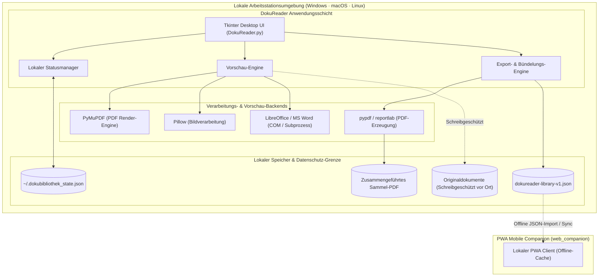
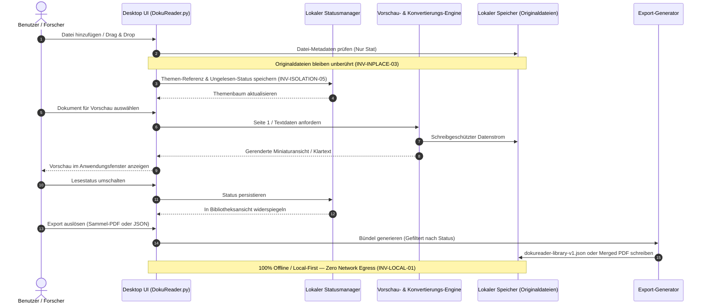

# DokuReader — Dokumentenbibliothek & PDF-Organizer

<p align="center"><a href="README.md">🇬🇧 English</a> · <strong>🇩🇪 Deutsch</strong></p>

> Dokumente nach Themen verwalten, vorschauen und bündeln — nur Verweise und Lesestatus, Originale bleiben am Platz.

[](LICENSE)
[](CHANGELOG.md#unreleased)
[](pyproject.toml)
[](DokuReader.py)
[](#einstieg--installation)
[](pyproject.toml)
[](web_companion)
[](PRIVACY_POLICY.md)
[](SECURITY.md)
[](SECURITY.md)
[](SECURITY.md)
[](THIRD_PARTY_LICENSES.md)
[](MARKETING-LOG.txt)
[](llms.txt)
[](https://github.com/doc-bricks)
[](https://github.com/open-bricks)
[](#qualitäts-gates--automatisierte-testsuiten)

> [!NOTE]
> DokuReader ist Teil der **doc-bricks** Suite für lokales Dokumentenmanagement. Es ergänzt [LitZentrum](https://github.com/doc-bricks/LitZentrum) (Literatur- & Zitationsverwaltung), [CleanMarkdown](https://github.com/doc-bricks/CleanMarkdown) (Markdown-Lese- & Editierumgebung) und [UniversalDocsGrabber](https://github.com/doc-bricks/UniversalDocsGrabber) (Mail-Anhang-Import). DokuReader ist für KI/LLM-Entwicklungsassistenten über [`llms.txt`](llms.txt) indexiert.

---

### Schnellnavigation
1. [Überblick & Kernnutzen](#überblick--kernnutzen)
2. [Kernfähigkeiten & Feature-Matrix](#kernfähigkeiten--feature-matrix)
3. [Interaktives Architektur-Flussdiagramm](#interaktives-architektur-flussdiagramm)
4. [Dokumenten-Lebenszyklus & Datenschutz-Sequenz](#dokumenten-lebenszyklus--datenschutz-sequenz)
5. [Einstieg & Installation](#einstieg--installation)
6. [Unterstützte Formate & Systemabhängigkeiten](#unterstützte-formate--systemabhängigkeiten)
7. [Windows Store & lokaler Build](#windows-store--lokaler-build)
8. [Mobile & PWA Companion](#mobile--pwa-companion)
9. [Governance & Laufzeit-Invarianten](#governance--laufzeit-invarianten)
10. [Geschwisterwerkzeuge & Ökosystem-Matrix](#geschwisterwerkzeuge--ökosystem-matrix)
11. [Datenschutz & Sicherheitsmodell](#datenschutz--sicherheitsmodell)
12. [Qualitäts-Gates & automatisierte Testsuiten](#qualitäts-gates--automatisierte-testsuiten)
13. [Maschinenlesbarer Kontext (`llms.txt`)](#maschinenlesbarer-kontext-llmstxt)
14. [Drittanbieter-Lizenzen & Transparenz](#drittanbieter-lizenzen--transparenz)
15. [Marketing & Zielgruppen](#marketing--zielgruppen)

---

## Überblick & Kernnutzen

DokuReader ist eine unprivilegierte Desktop-Anwendung zum Verwalten, Vorschauen und Bündeln von Dokumenten nach Themen. Originaldateien bleiben an ihrem Speicherort; die Anwendung speichert ausschließlich Pfadverweise und Lesestatus in einer lokalen JSON-Datei (`~/.dokubibliothek_state.json`).

DokuReader eignet sich insbesondere für vertrauliche Dokumentenbibliotheken, akademische Forschungsordner, juristische Akten und thematische Leseablagen, die vollständig offline, nachvollziehbar und manipulationssicher bleiben müssen.

| Ziel | Einstieg |
|---|---|
| Desktop-App starten | `python DokuReader.py` oder `START.bat` |
| Exportformat verstehen | [EXPORTFORMAT.md](EXPORTFORMAT.md) |
| Desktop-Quellstand testen | `python tests/source_platform_smoke.py` |
| Mobile/PWA-Companion prüfen | [web_companion/README.md](web_companion/README.md) |
| Windows-Store-Readiness prüfen | `python _WARTUNG/check_store_readiness.py --allow-blockers` |
| WACK-Reports vorbereiten oder parsen | `python _WARTUNG/run_windows_wack.py --dry-run` |
| Windows-Store-Texte vorbereiten | [STORE_LISTING.md](STORE_LISTING.md), [PRIVACY_POLICY.md](PRIVACY_POLICY.md), [SUPPORT.md](SUPPORT.md) |
| LLM-Tools Projektkontext geben | [`llms.txt`](llms.txt) |

### Versions- und Release-Status

Die Versionsrollen sind bewusst getrennt und aus dem aktuellen Quellstand abgelesen:
- **Entwicklungs-Runtime:** `1.0.1-dev` (`DokuReader.py` und `pyproject.toml` `1.0.1.dev0`)
- **Windows-Store-Metadaten:** `1.0.1.0` (`store_package.json`)
- **Release-Verifikation:** Ein öffentlich belegtes Release-Artefakt liegt in diesem Repository nicht vor. Signierung, MSIX, WACK und Store-Einreichung bleiben externe Gates; das Badge `1.0.1-dev` ist kein öffentlicher Store-Release-Claim. Siehe [RELEASE_STATUS.md](RELEASE_STATUS.md) und [PORTIERUNGSPLAN.md](PORTIERUNGSPLAN.md).

---

## Kernfähigkeiten & Feature-Matrix

- **Originaldatei-Schutz (INV-INPLACE-03):** Originaldateien werden niemals verschoben, kopiert, verändert oder überschrieben.
- **Dynamische Themenverwaltung:** Dokumententhemen flexibel erstellen, umbenennen, sortieren und löschen.
- **Gelesen- / Ungelesen-Warteschlange:** Status mit einem Klick umschalten; Exporte nach gelesen, ungelesen oder allen filtern.
- **Sofortige Dateivorschau:** Integrierte Vorschau für PDFs, Textdateien, Bilder (JPG, PNG, GIF) und Office-Dokumente (DOCX, ODT).
- **Textvorschau & Latin-1 Fallback:** Robuste Textdarstellung mit UTF-8 und Latin-1 Fallback-Dekodierung.
- **Drag-and-Drop Unterstützung:** Bequemer Dokumentenimport per Drag & Drop bei installiertem `tkinterdnd2`.
- **Systemweiter App-Aufruf:** Doppelklick öffnet die Originaldatei in der Standardanwendung des Betriebssystems.
- **Sammel-PDF-Erstellung:** Ausgewählte gelesene, ungelesene oder alle Dokumente zu einem einzigen Sammel-PDF zusammenführen.
- **Strukturierter JSON-Export:** Vollständige Bibliotheksstruktur als schema-konformes `dokureader-library-v1.json` exportieren, ohne Dateiinhalte einzubetten.
- **Office-Konvertierungspipeline:** Automatisierte Konvertierung von Office-Formaten über LibreOffice oder Microsoft Word COM.
- **Offline PWA Companion:** Zero-Egress Web-App für das mobile Durchsuchen von Bibliotheken und Aktualisieren des Lesestatus auf Smartphones und Tablets.

---

## Interaktives Architektur-Flussdiagramm



---

## Dokumenten-Lebenszyklus & Datenschutz-Sequenz



---

## Einstieg & Installation

### Voraussetzungen

- Python 3.10+
- Tkinter (standardmäßig in regulären Python-Installationen enthalten)

### Installation

```bash
git clone https://github.com/doc-bricks/DokuReader.git
cd DokuReader
pip install -r requirements.txt
```

### Schnellstart

```bash
python DokuReader.py
```

Unter Windows kann der Start direkt über die Batch-Datei erfolgen:

```bat
START.bat
```

---

## Unterstützte Formate & Systemabhängigkeiten

### Unterstützte Dokumentformate

- **Dokumente:** `.txt`, `.doc`, `.docx`, `.pdf`, `.odt`, `.rtf`
- **Bilder:** `.jpg`, `.jpeg`, `.gif`, `.png`

### Optionale Systemabhängigkeiten

Für den vollen Funktionsumfang bei Vorschau und Konvertierung:
- **LibreOffice:** Erforderlich für die automatisierte Konvertierung von DOC/DOCX/ODT/RTF nach PDF.
- **Poppler:** Erforderlich bei Nutzung des optionalen `pdf2image`-Vorschau-Backends.
- **Microsoft Word:** Unterstützt unter Windows für direkte COM-basierte Konvertierung.

---

## Windows Store & lokaler Build

### Lokaler Executable-Build

```bat
build_exe.bat
```

Build-Ausgaben unter `build/`, `dist/` und `releases/` bleiben rein lokal und sind über `.gitignore` vom Git-Tracking ausgeschlossen. Über die Umgebungsvariable `DOKUREADER_BUILD_ROOT` kann ein lokales Build-Verzeichnis vorgegeben werden.

### Windows Store Readiness Gate

```bash
python _WARTUNG/check_store_readiness.py --allow-blockers
```

Prüft Store-Metadaten, Datenschutzerklärungs-URLs, Pflicht-Support-Links, Bild-Assets, Screenshots und MSIX-Paketierungsanforderungen.

### WACK Runner & Parser

```bash
python _WARTUNG/run_windows_wack.py --dry-run
```

Erzeugt den exakten Zertifizierungsbefehl für die Ausführung mit erhöhten Rechten und parst resultierende XML-Berichte in strukturierte JSON-Dateien.

---

## Mobile & PWA Companion

Die Web-Begleitanwendung unter `web_companion/` bietet eine offline-fähige, mobile Leseansicht:
- **Installierbare PWA:** Vollständiges Web-App-Manifest mit iOS Safe-Area Unterstützung (`viewport-fit=cover`).
- **Offline Shell:** Isolierter Service Worker Cache, der externe Caches unangetastet lässt.
- **Round-Trip Synchronisation:** Importiert `dokureader-library-v1.json`, ermöglicht das Umschalten des Lesestatus auf Mobilgeräten und exportiert aktualisierte JSON-Dateien zurück zur Desktop-App.
- **Null Drittanbieter-Abhängigkeiten:** Basiert auf modernem Vanilla JavaScript und nativer Node.js Test-Runner-Ausführung (`35 passed, 0 failed`).

```bash
cd web_companion
node --test
```

---

## Governance & Laufzeit-Invarianten

Folgende 10 Invarianten sichern DokuReaders Laufzeitarchitektur, Datenschutzgrenze und Sicherheitsversprechen:

| Invariante | Prinzip | Garantie & Verifizierungsmechanismus |
|:---|:---|:---|
| **INV-LOCAL-01** | 100% Local-First & Zero-Egress | Keinerlei ausgehende Netzwerkverbindungen oder Telemetrie. Jegliche Verarbeitung erfolgt strikt offline. |
| **INV-RUNAS-02** | Unprivilegierte RunAsInvoker-Ausführung | Die Anwendung läuft ausschließlich im Standard-Benutzermodus ohne Administrator- oder Root-Rechte. |
| **INV-INPLACE-03** | In-Place Originaldatei-Schutz | Originaldokumente werden niemals verändert, verschoben oder überschrieben; Zugriff erfolgt rein lesend. |
| **INV-SCHEMA-04** | Deterministisches Export-Schema | Bibliotheks-Exporte folgen strikt der versionierten `dokureader-library-v1` JSON-Spezifikation. |
| **INV-ISOLATION-05** | Lokale Status- & Cache-Isolation | Status liegt isoliert in `~/.dokubibliothek_state.json`. PWA-Service-Worker isoliert im Cache `dokureader-companion-`. |
| **INV-SANDBOX-06** | Sichere Subprozess-Ausführung | Externe Konverter (LibreOffice, Word COM) werden mit festen Parametern, Timeouts und isolierten Temp-Pfaden ausgeführt. |
| **INV-PARITY-07** | Tri-Plattform Quellcode-Parität | Lauffähig unter Windows, macOS und Linux mit plattformunabhängiger Pfad- und Fallback-Verwaltung. |
| **INV-A11Y-08** | Tastatur- & visuelle Barrierefreiheit | Vollständige Tastaturnavigation, kontrastreiche Darstellung und deterministische UI-Zustände. |
| **INV-DISCOVERY-09** | Multimodale Transparenz & LLM-Bereitschaft | Vollständige zweisprachige Dokumentation (DE/EN), maschinenlesbares `llms.txt` und interaktive Dual-Mermaid-Diagramme. |
| **INV-SLA-10** | Sicherheitsrichtlinien-SLA | Verbindliche 48h-Erstreaktionszeit und 5-Werktage-Triage bei gemeldeten Sicherheitshinweisen. |

---

## Geschwisterwerkzeuge & Ökosystem-Matrix

DokuReader ist Kernbestandteil der **doc-bricks** Familie im Rahmen der **open-bricks** Open-Source-Initiative:

| Repository | Fokus | Rolle im Desktop-Workflow |
|:---|:---|:---|
| **[LitZentrum](https://github.com/doc-bricks/LitZentrum)** | Literatur & Zitationen | Akademische Fachliteratur-Bibliothek, BibTeX-Export und Zitationsverwaltung |
| **[CleanMarkdown](https://github.com/doc-bricks/CleanMarkdown)** | Markdown Studio | Fokussierter Markdown-Reader, Editor und typografischer Bereiniger |
| **[UniversalDocsGrabber](https://github.com/doc-bricks/UniversalDocsGrabber)** | Dokumenten-Import | Automatisierte Mail-Anhang-Extraktion und lokale Dokumentensortierung |
| **[UniversalInvoiceMail](https://github.com/doc-bricks/UniversalInvoiceMail)** | Rechnungs-Extraktion | Deterministische Erkennung und Ablage von Rechnungsanhängen |
| **[UniversalMailCleaner](https://github.com/doc-bricks/UniversalMailCleaner)** | Mail-Bereinigung | Lokale E-Mail-Archivbereinigung, Duplikatentfernung und Desinfektion |
| **[MailProcessor](https://github.com/doc-bricks/MailProcessor)** | Mail-Verarbeitung | Regelbasierte lokale Mail-Verteilung, Filterung und Dokumenten-Triage |
| **[PDFtoPDFocr](https://github.com/doc-bricks/PDFtoPDFocr)** | PDF OCR-Verarbeitung | Erstellung durchsuchbarer Sandwich-PDFs mit lokaler Tesseract-OCR |
| **[MediaBrain](https://github.com/doc-bricks/MediaBrain)** | Mediendatei-Organizer | Visuelles Medien-Tagging, Kategorisierung und Metadaten-Indexierung |
| **[DokuZen](https://github.com/doc-bricks/DokuZen)** | Ablenkungsfreies Lesen | Minimalistische Zen-Leseumgebung und Dokumenteninspektion |
| **[ProFiler](https://github.com/file-bricks/ProFiler)** | Multi-Tool Dateianalyse | Tiefgehende Datei-Inspektion, Struktur-Parser und Metadaten-Profiler |
| **[ExplorerPro](https://github.com/file-bricks/ExplorerPro)** | Erweiterter Dateimanager | Leistungsstarker Multi-Pane Desktop-Dateimanager |
| **[DevCenter](https://github.com/dev-bricks/DevCenter)** | Entwickler-Arbeitsplatz | Zentrales Entwickler-Dashboard und Projektmanagement-Zentrum |
| **[CodeBox](https://github.com/dev-bricks/CodeBox)** | Code-Snippet Vault | Offline-Code-Snippet-Organizer mit Syntaxhervorhebung |
| **[open-bricks](https://github.com/open-bricks)** | Dachorganisation | Gesamte Ökosystem-Koordination für modulare Desktop-Produktivität |

---

## Datenschutz & Sicherheitsmodell

- **Zero-Network-Egress:** Die Anwendung enthält keinerlei Telemetrie-Code, Analyse-Bibliotheken oder automatische Cloud-Abgleiche.
- **Originaldatei-Schutz:** Importierte Dokumente werden ausschließlich im schreibgeschützten Modus geöffnet.
- **RunAsInvoker Least Privilege:** Läuft vollständig im unprivilegierten Standard-Benutzerkontext.
- **Formale Sicherheits-SLA:** Sicherheitshinweise erhalten innerhalb von **48 Stunden** eine Eingangsbestätigung und innerhalb von **5 Werktagen** eine formale Triage. Berichte bitte an `security@open-bricks.org`, `security@ellmos.ai` oder über GitHub Security Advisories. Siehe [SECURITY.md](SECURITY.md).

---

## Qualitäts-Gates & automatisierte Testsuiten

Kontinuierliche Qualität wird durch unabhängige, automatisierte Prüfschritte gewährleistet:

```bash
# Python Unit- und Metadaten-Vertragstests ausführen (56 Tests)
pytest

# Statische Analyse und Linting durchführen
ruff check .

# Vollständige Bytecode-Kompilierung des Repositories prüfen
python -m compileall -q .

# Plattformübergreifenden Desktop-Smoke-Test ausführen
python tests/source_platform_smoke.py

# Testsuite des mobilen PWA-Companions ausführen (35 Tests)
cd web_companion && node --test
```

---

## Maschinenlesbarer Kontext (`llms.txt`)

Für autonome KI-Programmierassistenten (Claude Code, Gemini / Antigravity, Codex, Kimi Code) stellt DokuReader das vollständige Projektprofil strukturiert über [`llms.txt`](llms.txt) bereit. Es liefert kanonische Pfade, Abhängigkeitsgrenzen, Testbefehle, Suchbegriffe und Sicherheitsinvarianten in einem kompakten Format.

---

## Drittanbieter-Lizenzen & Transparenz

DokuReader steht unter der **GNU Affero General Public License v3.0 (AGPL-3.0)**. Alle Python-Drittanbieter-Bibliotheken (Pillow, pypdf, reportlab, python-docx, odfpy, tkinterdnd2, pywin32, pdf2image) nutzen freie Open-Source-Lizenzen (MIT, BSD-3-Clause, Apache-2.0, PSF-2.0) oder kompatibles AGPL-3.0 (PyMuPDF).

Das vollständige Abhängigkeits-Audit, die Lizenztexte und Unprivilegiertheits-Nachweise sind in [THIRD_PARTY_LICENSES.md](THIRD_PARTY_LICENSES.md) und [THIRD_PARTY_LICENSES.txt](THIRD_PARTY_LICENSES.txt) dokumentiert.

---

## Marketing & Zielgruppen

DokuReader bedient vier Kernzielgruppen mit hohen Datenschutzanforderungen:

1. **Legal Tech & Compliance-Analysten:** Organisationen mit vertraulichen Akten, Mandantendaten und Verträgen, die unter DSGVO oder HIPAA keinesfalls in Cloud-Dienste hochgeladen werden dürfen.
2. **Wissenschaftliche Forscher & Literatur-Kuratoren:** Akademiker, die Fachartikel, Preprints und Reports thematisch ordnen wollen, ohne ihre gewachsene Ordnerstruktur aufzugeben.
3. **Offline-First Wissensarbeiter:** Datenschutzbewusste Nutzer, die deterministische Desktop-Werkzeuge ohne Cloud-Zwang bevorzugen.
4. **KI-Desktop-Entwickler & Coding Agents:** Autonome Agenten, die strukturierte `dokureader-library-v1.json` Metadaten-Exporte für nachgelagerte Analyse-Pipelines nutzen.

Suchbegriffe, die 4-Wege-Vergleichsmatrix und die Marketing-Audit-Historie sind in [MARKETING-LOG.txt](MARKETING-LOG.txt) aufgeführt.

---

## Lizenz & Haftungsausschluss

Lizenziert unter der [GNU Affero General Public License v3.0](LICENSE). Bereitstellung ohne Gewähr; siehe LICENSE für die vollständigen Bedingungen.
